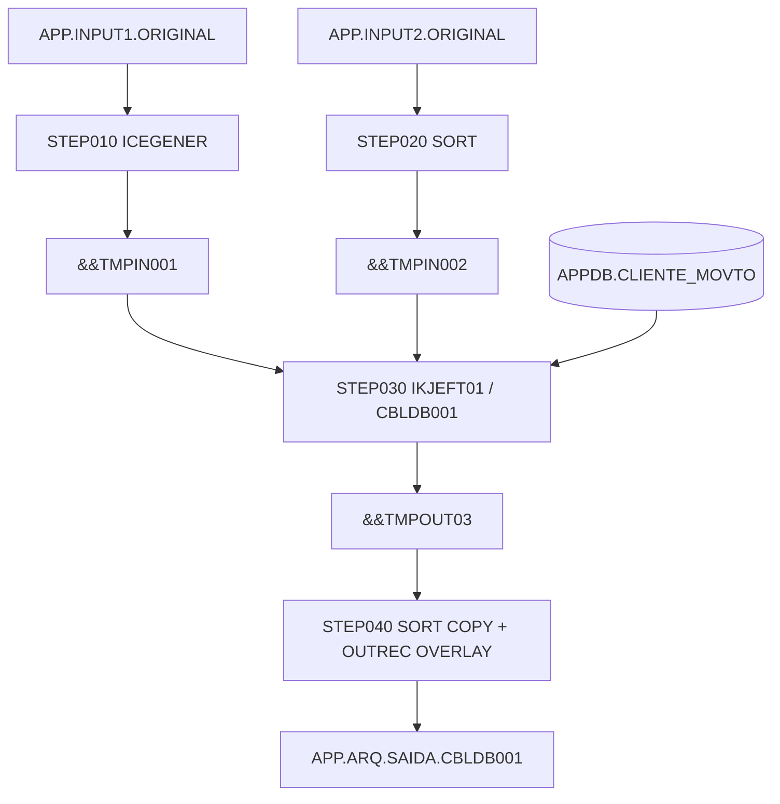
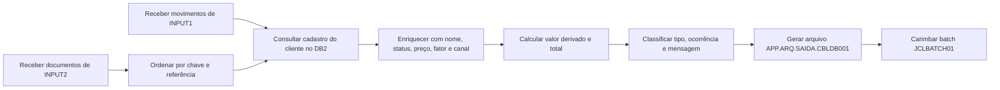
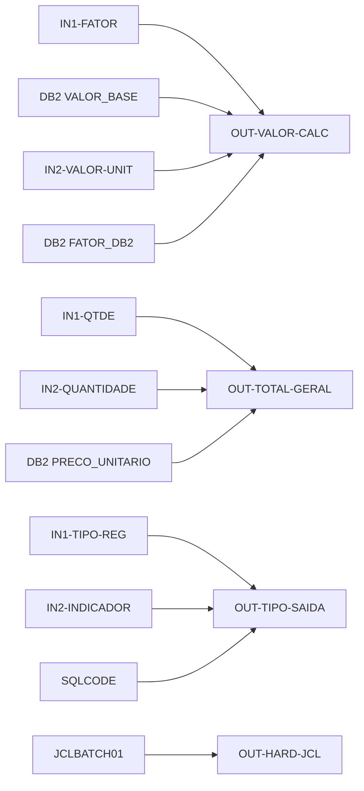

# JCLDB001 - documentação de negócio e lineage

## Sumário executivo

O job JCLDB001 recebe dois conjuntos de dados operacionais, padroniza essas entradas, enriquece cada registro com dados cadastrais do DB2 e produz um arquivo final único para consumo downstream. O primeiro ramo processa movimentos associados a agência, conta, quantidade e fator. O segundo ramo processa documentos ou itens com quantidade, valor unitário e indicador operacional.

O valor de negócio do fluxo está em transformar entradas heterogêneas em um layout único, já com classificação operacional, métricas financeiras calculadas e tratamento explícito para casos sem cadastro ou com erro de acesso ao DB2. O job ainda grava marcadores técnicos dentro do registro para rastreabilidade de origem e do batch executor.

## Fluxo de negócio em linguagem simples

O fluxo começa com duas entradas de negócio diferentes. Uma delas representa movimentos de clientes, com chave, agência, conta, quantidade e fator de cálculo. A outra representa documentos ou itens, com chave, documento, valor unitário, quantidade e indicador.

Antes de qualquer cálculo, o job apenas prepara os arquivos. INPUT1 é copiado sem alteração semântica para um temporário. INPUT2 é ordenado por chave e componente temporal, o que estabiliza a sequência de processamento. Depois disso, para cada registro dos dois ramos, o programa principal consulta a tabela APPDB.CLIENTE_MOVTO para recuperar nome do cliente, status cadastral, código interno, data de cadastro, valor base, preço unitário, fator cadastral e canal preferencial.

Com o enriquecimento em mãos, o processo calcula valores de negócio. No ramo INPUT1, o valor calculado usa o valor base do cadastro multiplicado pelo fator do movimento. No ramo INPUT2, o valor calculado usa o valor unitário do documento multiplicado pelo fator cadastral retornado pelo DB2. Em ambos os casos, o total geral usa a quantidade da entrada combinada com o preço unitário do cadastro.

No final, todos os registros convergem para um arquivo único de saída. Esse arquivo leva tipo de saída, ocorrência, mensagem operacional, marcadores de origem e um identificador final do job aplicado no último step do JCL. Quando o cliente não é encontrado no DB2, o registro não é descartado: ele segue para saída com códigos e mensagens próprias para tratamento posterior.

## Artefatos analisados

| Artefato | Tipo | Papel no fluxo |
| --- | --- | --- |
| mainframe/JCL/JCLDB001.jcl | JCL | Orquestra os steps, datasets temporários e saída final |
| mainframe/programas/CBLDB001.cbl | COBOL/DB2 | Programa principal que lê entradas, consulta DB2, calcula e grava saída |
| mainframe/copybooks/CPYIN001.cpy | Copybook | Layout da entrada INPUT1 |
| mainframe/copybooks/CPYIN002.cpy | Copybook | Layout da entrada INPUT2 |
| mainframe/copybooks/CPYOUT01.cpy | Copybook | Layout da saída do STEP030 e da saída final |
| mainframe/dclgen/DCLTB001.dcl | DCLGEN | Estrutura da tabela APPDB.CLIENTE_MOVTO e host variables |

## Fluxo de execução do JCL e dos steps

| Step | Programa | Entrada | Saída | Papel de negócio |
| --- | --- | --- | --- | --- |
| STEP010 | ICEGENER | APP.INPUT1.ORIGINAL | &&TMPIN001 | Copia INPUT1 para uso interno sem alterar seu significado |
| STEP020 | SORT | APP.INPUT2.ORIGINAL | &&TMPIN002 | Ordena INPUT2 por chave e referência temporal |
| STEP030 | IKJEFT01 executando CBLDB001 | &&TMPIN001, &&TMPIN002 e DB2 | &&TMPOUT03 | Enriquece, calcula e classifica registros dos dois ramos |
| STEP040 | SORT | &&TMPOUT03 | APP.ARQ.SAIDA.CBLDB001 | Preserva a saída e injeta identificador técnico do batch |

## Significado de negócio de cada step / ramo principal

### STEP010 - cópia de INPUT1

Evidência observada:

- O JCL usa ICEGENER com SYSUT1 apontando para APP.INPUT1.ORIGINAL e SYSUT2 apontando para &&TMPIN001.
- Não há cartão de transformação em SYSIN; o SYSIN é DUMMY.

Interpretação inferida:

- O objetivo é somente disponibilizar INPUT1 em um dataset temporário para o programa COBOL, sem qualquer alteração de regra de negócio.

nível de confiança: alto

### STEP020 - ordenação de INPUT2

Evidência observada:

- O cartão de controle é SORT FIELDS=(1,10,CH,A,53,8,CH,A).
- O layout de CPYIN002 contém chave e data de referência no registro de entrada.

Interpretação inferida:

- O arquivo INPUT2 é preparado em ordem estável por chave e componente temporal, o que ajuda a manter consistência operacional antes do processamento do ramo.

nível de confiança: alto

### STEP030 - ramo principal de INPUT1

Evidência observada:

- O programa move IN1-CHAVE para WS-CHAVE-PESQUISA e executa 5000-BUSCA-DB2.
- O programa move IN1-AGENCIA, IN1-CONTA, IN1-QTDE, IN1-FATOR e IN1-CANAL para o layout de saída.
- O programa calcula OUT-VALOR-CALC = HV-VALOR-BASE * IN1-FATOR.
- O programa calcula OUT-TOTAL-GERAL = IN1-QTDE * HV-PRECO-UNITARIO.

Interpretação inferida:

- Esse ramo transforma movimentos operacionais em registros financeiros enriquecidos, preservando atributos do próprio movimento e agregando parâmetros cadastrais do cliente.

nível de confiança: alto

### STEP030 - ramo principal de INPUT2

Evidência observada:

- O programa move IN2-CHAVE para WS-CHAVE-PESQUISA e executa 5000-BUSCA-DB2.
- O programa move IN2-DOCUMENTO e IN2-QUANTIDADE para a saída.
- O programa grava OUT-FATOR com o literal 00150.
- O programa calcula OUT-VALOR-CALC = IN2-VALOR-UNIT * HV-FATOR-DB2.
- O programa sobrescreve OUT-CANAL-SAIDA com HV-CANAL-PREFERENC quando o lookup é bem-sucedido.

Interpretação inferida:

- Esse ramo transforma documentos ou itens em registros enriquecidos e usa o cadastro do cliente para orientar tanto o cálculo quanto o canal final de encaminhamento.

nível de confiança: alto

### STEP040 - fechamento do arquivo final

Evidência observada:

- O cartão de controle usa SORT FIELDS=COPY.
- O cartão OUTREC OVERLAY=(291:C'JCLBATCH01') injeta um literal no final do registro.

Interpretação inferida:

- O step não altera os campos de negócio produzidos no STEP030. Ele apenas acrescenta um carimbo técnico de batch no layout final.

nível de confiança: alto

## Datasets, tabelas DB2, arquivos VSAM e utilities envolvidos

### Datasets e utilities

| Nome | Tipo | Uso no fluxo |
| --- | --- | --- |
| APP.INPUT1.ORIGINAL | Arquivo sequencial FB 80 | Entrada do ramo de movimentos |
| APP.INPUT2.ORIGINAL | Arquivo sequencial FB 100 | Entrada do ramo de documentos/itens |
| &&TMPIN001 | Temporário FB 80 | Cópia operacional de INPUT1 |
| &&TMPIN002 | Temporário FB 100 | INPUT2 ordenado |
| &&TMPOUT03 | Temporário FB 300 | Saída do programa principal |
| APP.ARQ.SAIDA.CBLDB001 | Arquivo sequencial FB 300 | Arquivo final do job |
| ICEGENER | Utility | Cópia física sem mudança semântica |
| SORT | Utility | Ordenação de INPUT2 e overlay final |

### Tabela DB2

Tabela consultada: APPDB.CLIENTE_MOVTO

| Coluna DB2 | Papel de negócio |
| --- | --- |
| CHAVE_CLIENTE | Chave de lookup do cliente |
| NOME_CLIENTE | Nome replicado para a saída |
| STATUS_CLIENTE | Situação cadastral usada em mensagem e classificação |
| CODIGO_DB2 | Código interno do cadastro |
| DATA_CADASTRO | Data cadastral replicada na saída |
| VALOR_BASE | Base financeira usada no ramo INPUT1 |
| PRECO_UNITARIO | Preço corporativo usado no cálculo do total |
| FATOR_DB2 | Fator cadastral usado no ramo INPUT2 |
| CANAL_PREFERENC | Canal preferencial que pode substituir o canal padrão do ramo INPUT2 |

### Arquivos VSAM

Evidência observada:

- Não há definição de VSAM no JCL nem instruções START ou acesso indexado no COBOL.

Interpretação inferida:

- O fluxo depende de arquivos sequenciais e DB2, sem participação de VSAM.

nível de confiança: alto

## Lineage dos campos relevantes

### Campo alvo: OUT-VALOR-CALC

- dataset de destino: APP.ARQ.SAIDA.CBLDB001
- origem(ns) upstream: HV-VALOR-BASE e IN1-FATOR no ramo INPUT1; IN2-VALOR-UNIT e HV-FATOR-DB2 no ramo INPUT2
- caminho upstream completo: STEP030 / CBLDB001 <- INPUT1 + DB2 ou INPUT2 + DB2
- step e programa responsáveis: STEP030 / CBLDB001
- regra ou transformação aplicável: cálculo aritmético
- expressão ou trecho de evidência:
  - COMPUTE OUT-VALOR-CALC = HV-VALOR-BASE * IN1-FATOR
  - COMPUTE OUT-VALOR-CALC = IN2-VALOR-UNIT * HV-FATOR-DB2
- classificação semântica da transformação: cálculo aritmético
- propósito de negócio: gerar um valor derivado para uso operacional e analítico
- explicação orientada ao negócio: o valor final depende da origem do registro e combina atributos da entrada com parâmetros do cadastro do cliente
- explicação da regra em linguagem simples: no ramo INPUT1 o cálculo usa base do cadastro e fator do movimento; no ramo INPUT2 usa valor do documento e fator cadastral
- exemplo(s) de entrada:
  - INPUT1: VALOR_BASE 1250,00 e FATOR 1,25
  - INPUT2: VALOR_UNIT 300,00
- exemplo(s) de lookup quando aplicável:
  - INPUT2: FATOR_DB2 1,10
- valor de saída no exemplo:
  - INPUT1: 1562,50
  - INPUT2: 330,00
- nível de confiança: alto

### Campo alvo: OUT-TOTAL-GERAL

- dataset de destino: APP.ARQ.SAIDA.CBLDB001
- origem(ns) upstream: quantidade da entrada e PRECO_UNITARIO do DB2
- caminho upstream completo: STEP030 / CBLDB001 <- INPUT1 + DB2 ou INPUT2 + DB2
- step e programa responsáveis: STEP030 / CBLDB001
- regra ou transformação aplicável: cálculo aritmético
- expressão ou trecho de evidência:
  - COMPUTE OUT-TOTAL-GERAL = IN1-QTDE * HV-PRECO-UNITARIO
  - COMPUTE OUT-TOTAL-GERAL = IN2-QUANTIDADE * HV-PRECO-UNITARIO
- classificação semântica da transformação: cálculo aritmético
- propósito de negócio: calcular o total financeiro do registro com base no preço corporativo do cadastro
- explicação orientada ao negócio: independentemente da origem, o total usa o preço unitário oficial do cliente no DB2
- explicação da regra em linguagem simples: multiplica a quantidade recebida pelo preço unitário retornado no cadastro
- exemplo(s) de entrada: quantidade 12
- exemplo(s) de lookup quando aplicável: PRECO_UNITARIO 45,50
- valor de saída no exemplo: 546,00
- nível de confiança: alto

### Campo alvo: OUT-TIPO-SAIDA

- dataset de destino: APP.ARQ.SAIDA.CBLDB001
- origem(ns) upstream: IN1-TIPO-REG, IN2-INDICADOR e SQLCODE
- caminho upstream completo: STEP030 / CBLDB001
- step e programa responsáveis: STEP030 / CBLDB001
- regra ou transformação aplicável: atribuição condicional
- expressão ou trecho de evidência:
  - IF IN1-TIPO-REG = 'A' MOVE 'A1' ELSE MOVE 'A2'
  - IF IN2-INDICADOR = 'S' MOVE 'B1' ELSE MOVE 'B2'
  - SQLCODE = 100 -> ND
  - SQLCODE diferente de 0 e 100 -> ER
- classificação semântica da transformação: atribuição condicional
- propósito de negócio: classificar o registro para consumo downstream
- explicação orientada ao negócio: o campo comunica a família operacional do registro e também denuncia exceções técnicas de lookup
- explicação da regra em linguagem simples: cada ramo tem sua própria regra de classificação; se o DB2 falhar, o tipo passa a indicar não encontrado ou erro
- exemplo(s) de entrada:
  - INPUT1 com TIPO-REG A
  - INPUT2 com INDICADOR S
- exemplo(s) de lookup quando aplicável: SQLCODE 100
- valor de saída no exemplo:
  - A1 para INPUT1
  - B1 para INPUT2
  - ND para cliente não encontrado
- nível de confiança: alto

### Campo alvo: OUT-HARD-JCL

- dataset de destino: APP.ARQ.SAIDA.CBLDB001
- origem(ns) upstream: literal do JCL
- caminho upstream completo: STEP040 / SORT OUTREC OVERLAY
- step e programa responsáveis: STEP040 / SORT
- regra ou transformação aplicável: constante / hard code
- expressão ou trecho de evidência: OUTREC OVERLAY=(291:C'JCLBATCH01')
- classificação semântica da transformação: constante / hard code
- propósito de negócio: identificar qual job concluiu a gravação final do arquivo
- explicação orientada ao negócio: o campo não vem das entradas nem do DB2; ele é inserido no fechamento do batch
- explicação da regra em linguagem simples: todos os registros finais recebem o mesmo identificador técnico do job
- exemplo(s) de entrada: não se aplica
- exemplo(s) de lookup quando aplicável: não se aplica
- valor de saída no exemplo: JCLBATCH01
- nível de confiança: alto

## Regras de negócio identificadas

| Regra | Tipo | Descrição de negócio |
| --- | --- | --- |
| R1 | cópia direta | INPUT1 é copiado para temporário sem mudança semântica |
| R2 | reordenação sem mudança semântica | INPUT2 é ordenado por chave e componente temporal antes do processamento |
| R3 | resultado de lookup externo | O cadastro do cliente é buscado no DB2 pela chave da entrada |
| R4 | cálculo aritmético | OUT-VALOR-CALC usa fórmula diferente por ramo |
| R5 | cálculo aritmético | OUT-TOTAL-GERAL usa quantidade da entrada e preço unitário do DB2 |
| R6 | atribuição condicional | OUT-TIPO-SAIDA e OUT-OCORRENCIA dependem do tipo ou indicador de origem |
| R7 | constante / hard code | O ramo INPUT2 grava 00150 em OUT-FATOR |
| R8 | constante / hard code | OUT-HARD1, OUT-HARD2 e OUT-HARD3 marcam origem e processo |
| R9 | atribuição condicional | A mensagem final depende do status cadastral ou da falha no lookup |
| R10 | constante / hard code | O STEP040 injeta JCLBATCH01 na área final do registro |

## Exemplos práticos com valores de campos

### Exemplo prático 1 - movimento do ramo INPUT1

Valores de entrada:

- IN1-CHAVE = 0000001234
- IN1-TIPO-REG = A
- IN1-QTDE = 12
- IN1-FATOR = 1,25
- IN1-CANAL = AG

Valores de lookup:

- NOME_CLIENTE = CLIENTE ALFA
- STATUS_CLIENTE = A
- VALOR_BASE = 1250,00
- PRECO_UNITARIO = 45,50

Regra aplicada:

- OUT-VALOR-CALC = 1250,00 x 1,25 = 1562,50
- OUT-TOTAL-GERAL = 12 x 45,50 = 546,00
- OUT-TIPO-SAIDA = A1
- OUT-OCORRENCIA = 000

Resultado final:

- O registro sai como movimento ativo processado, com valor derivado, total calculado e canal herdado do movimento.

Visão de negócio:

- Um movimento normal de cliente ativo já sai preparado para consumo downstream sem necessidade de reclassificação manual.

### Exemplo prático 2 - documento do ramo INPUT2

Valores de entrada:

- IN2-CHAVE = 0000005678
- IN2-DOCUMENTO = DOC000000000123
- IN2-VALOR-UNIT = 300,00
- IN2-QUANTIDADE = 4
- IN2-INDICADOR = S

Valores de lookup:

- FATOR_DB2 = 1,10
- PRECO_UNITARIO = 80,00
- CANAL_PREFERENC = WE
- STATUS_CLIENTE = I

Regra aplicada:

- OUT-VALOR-CALC = 300,00 x 1,10 = 330,00
- OUT-TOTAL-GERAL = 4 x 80,00 = 320,00
- OUT-TIPO-SAIDA = B1
- OUT-OCORRENCIA = 000
- OUT-CANAL-SAIDA = WE

Resultado final:

- O registro do ramo 2 sai com canal preferencial do cliente e com cálculo baseado no fator cadastral.

Visão de negócio:

- O cadastro do cliente não só enriquece o registro, como também altera o canal final de encaminhamento.

### Exemplo prático 3 - cliente não localizado no DB2

Valores de entrada:

- CHAVE = 9999999999

Valores de lookup:

- SQLCODE = 100

Regra aplicada:

- OUT-OCORRENCIA = 404
- OUT-TIPO-SAIDA = ND
- OUT-NOME = NAO ENCONTRADO
- Campos financeiros = zero

Resultado final:

- O registro é gravado mesmo sem cadastro correspondente.

Visão de negócio:

- O processo preserva o evento para investigação posterior em vez de descartá-lo.

## Hard codes e constantes

| Campo | Valor | Classificação | Papel de negócio | nível de confiança |
| --- | --- | --- | --- | --- |
| OUT-ORIGEM | 1 no ramo INPUT1 e 2 no ramo INPUT2 | constante condicional | Identifica a origem lógica do registro | alto |
| OUT-HARD1 | ORIGEMIN1 ou ORIGEMIN2 | constante condicional | Marca a origem técnica do ramo | alto |
| OUT-HARD2 | PROCESSA01 ou PROCESSA02 | constante condicional | Marca o bloco de processo aplicado | alto |
| OUT-HARD3 | LE-DB2-I1 ou LE-DB2-I2 | constante condicional | Indica o caminho técnico de leitura do DB2 | alto |
| OUT-FATOR | 00150 no ramo INPUT2 | constante literal | Mantém um fator fixo registrado no layout do ramo 2 | alto |
| OUT-CANAL-SAIDA | B2 antes do override no ramo INPUT2 | constante literal | Define um default técnico inicial no ramo 2 | alto |
| OUT-HARD-JCL | JCLBATCH01 | constante literal | Carimbo técnico do job aplicando o fechamento final | alto |

## Pontos de lookup em DB2 / VSAM

Evidência observada:

- O único ponto de lookup externo é o SELECT na tabela APPDB.CLIENTE_MOVTO.
- Não há acesso VSAM identificado no JCL nem no COBOL.

Interpretação inferida:

- Toda a inteligência de enriquecimento externo do fluxo depende exclusivamente do cadastro DB2. Sem esse cadastro, o job produz um registro de exceção com defaults controlados.

nível de confiança: alto

## Decisões condicionais e derivações

| Condição | Resultado | Efeito de negócio |
| --- | --- | --- |
| IN1-TIPO-REG = A | OUT-TIPO-SAIDA = A1 e OUT-OCORRENCIA = 000 | Movimento do ramo 1 segue classe principal |
| IN1-TIPO-REG diferente de A | OUT-TIPO-SAIDA = A2 e OUT-OCORRENCIA = 010 | Movimento do ramo 1 segue classe alternativa |
| IN2-INDICADOR = S | OUT-TIPO-SAIDA = B1 e OUT-OCORRENCIA = 000 | Documento do ramo 2 segue classe principal |
| IN2-INDICADOR diferente de S | OUT-TIPO-SAIDA = B2 e OUT-OCORRENCIA = 020 | Documento do ramo 2 segue classe alternativa |
| STATUS_CLIENTE = A | Mensagem de cliente ativo | Sinaliza cliente cadastralmente ativo |
| SQLCODE = 100 | Tipo ND e ocorrência 404 | Registra ausência de cadastro sem perder o evento |
| SQLCODE diferente de 0 e 100 | Tipo ER e ocorrência 999 | Registra falha técnica de acesso ao DB2 |

## Lacunas, inferências e notas de confiança

| Tema | Evidência observada | Interpretação inferida | nível de confiança |
| --- | --- | --- | --- |
| Segunda chave do SORT de INPUT2 | O JCL usa posição 53 com comprimento 8 | A ordenação considera um componente temporal do layout de INPUT2 | alto |
| Semântica exata de INPUT2 | O copybook mostra documento, indicador, produto e moeda | O ramo representa documentos ou itens operacionais/comerciais | médio |
| Uso de OUT-HARD1, OUT-HARD2 e OUT-HARD3 | Literais fixos no programa | Esses campos servem à rastreabilidade e auditoria técnica | médio |
| Participação de VSAM | Nenhuma evidência de acesso indexado | O fluxo não usa VSAM | alto |

