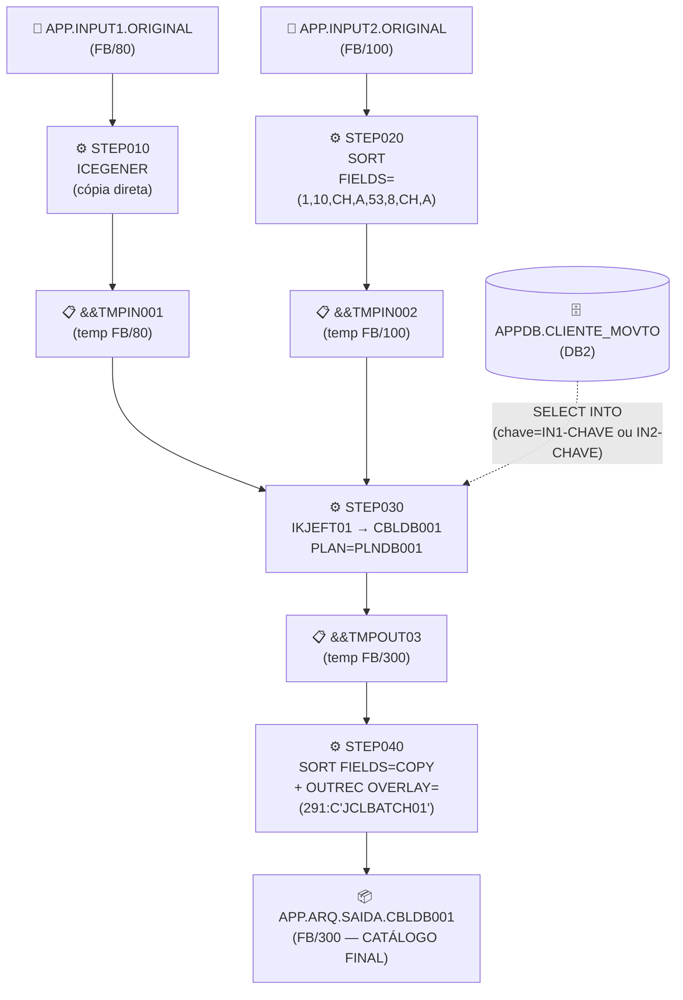
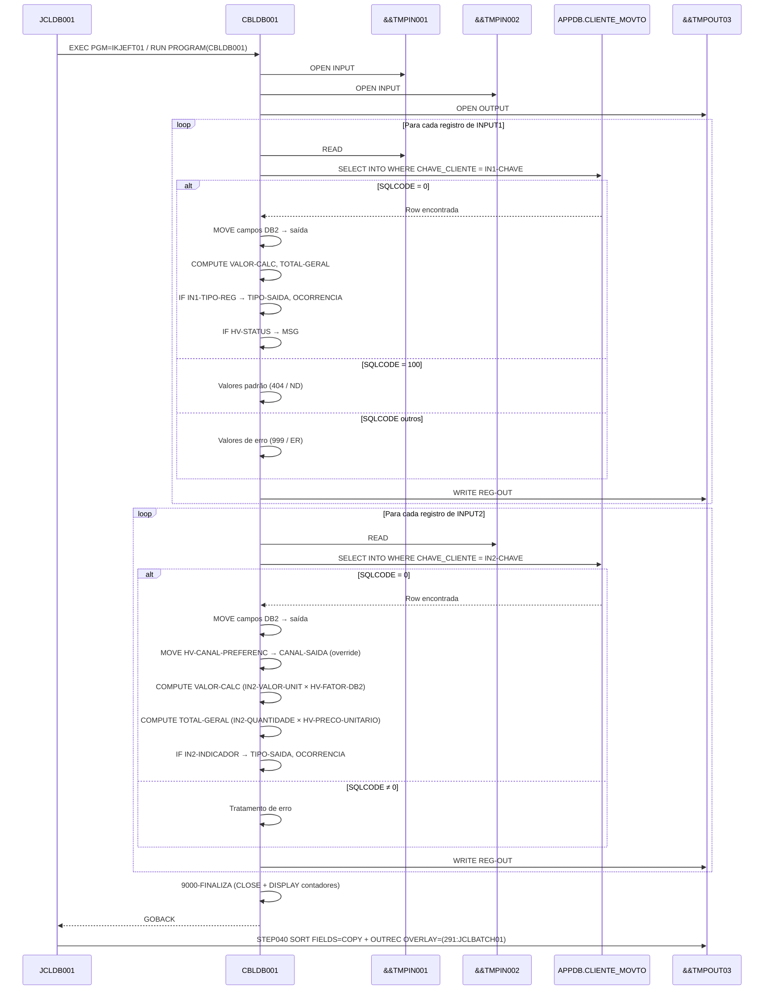

# JCLDB001 — Documentação de Lineage e Regras de Negócio

> **Gerado em:** 05/04/2026  
> **Escopo:** Job JCL `JCLDB001` e todos os seus artefatos associados  
> **Confidencialidade:** observação, inferência e nível de confiança explicitados em cada seção

---

## 1. Sumário Executivo

O job `JCLDB001` é um processo batch mainframe que:

1. **Copia** o arquivo físico de entrada INPUT1 para um dataset temporário (STEP010 — ICEGENER).
2. **Ordena** o arquivo físico de entrada INPUT2 por chave e data (STEP020 — SORT).
3. **Processa** os dois arquivos temporários com enriquecimento via lookup DB2 na tabela `APPDB.CLIENTE_MOVTO`, produzindo um arquivo de saída com campos calculados e hard codes (STEP030 — `CBLDB001`).
4. **Finaliza** com um SORT que copia todos os registros e injeta o marcador de processamento `JCLBATCH01` na posição 291 do registro de saída (STEP040 — SORT + OUTREC).

O programa central é `CBLDB001.cbl`, que realiza dois fluxos distintos:
- **Ramo IN1:** leitura sequencial de INPUT1, enriquecimento DB2, cálculos aritméticos e atribuição condicional de tipo/ocorrência.
- **Ramo IN2:** leitura sequencial de INPUT2, enriquecimento DB2, fator fixo (hard code `'00150'`), canal de saída substituído pelo canal preferencial do DB2, cálculo diferente de valor e total.

---

## 2. Artefatos Analisados

| ID  | Tipo      | Nome          | Caminho                        | Papel                                        |
|-----|-----------|---------------|-------------------------------|----------------------------------------------|
| A001 | JCL      | JCLDB001      | `JCL/JCLDB001.jcl`            | Controle do job — 4 steps, datasets físicos  |
| A002 | PROGRAMA  | CBLDB001      | `programas/CBLDB001.cbl`       | Programa principal COBOL/DB2 (STEP030)       |
| A003 | COPYBOOK  | CPYIN001      | `copybooks/CPYIN001.cpy`       | Layout do registro de INPUT1 (LRECL=80)      |
| A004 | COPYBOOK  | CPYIN002      | `copybooks/CPYIN002.cpy`       | Layout do registro de INPUT2 (LRECL=100)     |
| A005 | COPYBOOK  | CPYOUT01      | `copybooks/CPYOUT01.cpy`       | Layout do registro de saída (LRECL=300)      |
| A006 | DCLGEN    | DCLTB001      | `dclgen/DCLTB001.dcl`          | Host variables e DDL da tabela DB2           |

---

## 3. Fluxo JCL — Steps e Datasets

### 3.1 Diagrama de Fluxo do Job



### 3.2 Tabela de Steps

| Step    | Sequência | Programa   | Tipo          | Entrada(s)                       | Saída               | Descrição                                                            |
|---------|-----------|------------|---------------|----------------------------------|---------------------|----------------------------------------------------------------------|
| STEP010 | 10        | ICEGENER   | copy          | APP.INPUT1.ORIGINAL              | &&TMPIN001          | Cópia 1:1 sem transformação semântica                                |
| STEP020 | 20        | SORT       | sort          | APP.INPUT2.ORIGINAL              | &&TMPIN002          | Ordenação por posições 1–10 (chave) e 53–60 (data ref), ascendente  |
| STEP030 | 30        | CBLDB001   | cobol_db2     | &&TMPIN001, &&TMPIN002, DB2      | &&TMPOUT03          | Processamento principal: enriquecimento, cálculo, hard codes         |
| STEP040 | 40        | SORT       | sort+overlay  | &&TMPOUT03                       | APP.ARQ.SAIDA...    | Cópia final + injeção do marcador `JCLBATCH01` na posição 291        |

---

## 4. Datasets, Tabelas DB2 e Utilities

### 4.1 Datasets Físicos

| Dataset                    | RECFM | LRECL | Disp      | Papel            |
|---------------------------|-------|-------|-----------|------------------|
| APP.INPUT1.ORIGINAL        | FB    | 80    | SHR       | Entrada primária (movimentos) |
| APP.INPUT2.ORIGINAL        | FB    | 100   | SHR       | Entrada secundária (documentos/produtos) |
| APP.ARQ.SAIDA.CBLDB001     | FB    | 300   | NEW,CATLG | Saída definitiva catalogada |

### 4.2 Datasets Temporários

| Dataset     | RECFM | LRECL | DISP        | Papel                                        |
|-------------|-------|-------|-------------|----------------------------------------------|
| &&TMPIN001  | FB    | 80    | PASS/DELETE | INPUT1 pós-ICEGENER; consumido no STEP030    |
| &&TMPIN002  | FB    | 100   | PASS/DELETE | INPUT2 pós-SORT; consumido no STEP030        |
| &&TMPOUT03  | FB    | 300   | PASS/DELETE | Saída do CBLDB001; consumida no STEP040      |

### 4.3 Tabela DB2 — APPDB.CLIENTE_MOVTO

| Coluna           | Tipo DB2        | Host Variable         | Uso no Programa                         |
|------------------|-----------------|-----------------------|-----------------------------------------|
| CHAVE_CLIENTE    | CHAR(10)        | HV-CHAVE-CLIENTE      | **Chave de lookup** (WHERE clause)      |
| NOME_CLIENTE     | CHAR(30)        | HV-NOME-CLIENTE       | → OUT-NOME                             |
| STATUS_CLIENTE   | CHAR(1)         | HV-STATUS-CLIENTE     | → OUT-STATUS + controle de OUT-MSG      |
| CODIGO_DB2       | CHAR(5)         | HV-CODIGO-DB2         | → OUT-CODIGO-DB2                       |
| DATA_CADASTRO    | CHAR(10)        | HV-DATA-CADASTRO      | → OUT-DATA-CAD                         |
| VALOR_BASE       | DECIMAL(9,2)    | HV-VALOR-BASE         | → OUT-VALOR-BASE + cálculo IN1         |
| PRECO_UNITARIO   | DECIMAL(7,2)    | HV-PRECO-UNITARIO     | → OUT-PRECO-DB2 + cálculo total        |
| FATOR_DB2        | DECIMAL(3,2)    | HV-FATOR-DB2          | Multiplicador do cálculo IN2           |
| CANAL_PREFERENC  | CHAR(2)         | HV-CANAL-PREFERENC    | Sobrescreve OUT-CANAL-SAIDA no ramo IN2|

> **observado:** `SELECT ... WITH UR` — leitura sem espera de lock (Uncommitted Read). Confirma natureza batch analítica.  
> **confiança:** high — DDL explícita no DCLTB001 e SELECT INTO explícito no CBLDB001.

### 4.4 Utility SORT — STEP020

```
SORT FIELDS=(1,10,CH,A,53,8,CH,A)
```

| Posição | Comprimento | Tipo | Ordem | Campo correspondente (CPYIN002) |
|---------|-------------|------|-------|---------------------------------|
| 1       | 10          | CH   | ASC   | IN2-CHAVE                       |
| 53      | 8           | CH   | ASC   | IN2-DATA-REF                    |

> **inferido:** posição 53 = soma dos campos anteriores: CHAVE(10) + SEGMENTO(2) + DOCUMENTO(14) + VALOR-UNIT(9) + QUANTIDADE(4) + INDICADOR(1) + COD-PROD(5) + DATA-REF(8) — offset 1-based = 1+10+2+14+9+4+1+5 = 46 → posição 47 (com deslocamento relativo). Recalculando: CHAVE=1–10, SEGMENTO=11–12, DOCUMENTO=13–26, VALOR-UNIT=27–35, QUANTIDADE=36–39, INDICADOR=40, COD-PROD=41–45, DATA-REF=46–53. **Posição 53 confirma IN2-DATA-REF (último byte).**  
> **confiança:** high.

### 4.5 Utility SORT — STEP040 com OUTREC OVERLAY

```
SORT FIELDS=COPY
INREC BUILD=(1,300)
OUTREC OVERLAY=(291:C'JCLBATCH01')
```

- **SORT FIELDS=COPY** → todos os 300 bytes preservados na ordem original.
- **INREC BUILD=(1,300)** → reconstrução idêntica do registro de 300 bytes.
- **OUTREC OVERLAY=(291:C'JCLBATCH01')** → injeta a constante literal `JCLBATCH01` (10 bytes) na posição 291, correspondente ao campo `OUT-HARD-JCL` definido em CPYOUT01.

> **observado:** CPYOUT01 define `05 OUT-HARD-JCL PIC X(10)` como último campo nominal. Calculando offset: soma dos campos anteriores chega a 291 (1-based), confirmando a correspondência.  
> **confiança:** high.

---

## 5. Layouts de Registros (Copybooks)

### 5.1 CPYIN001 — REG-IN001 (INPUT1, LRECL=80)

| Campo         | PIC         | Tipo    | Pos  | Tam | Descrição de Negócio          |
|---------------|-------------|---------|------|-----|-------------------------------|
| IN1-CHAVE     | X(10)       | CHAR    | 1    | 10  | Chave de identificação do cliente/movimentação |
| IN1-TIPO-REG  | X(01)       | CHAR    | 11   | 1   | Tipo do registro (`A`=tipo A, outro=tipo B) |
| IN1-AGENCIA   | 9(04)       | NUMERIC | 12   | 4   | Código da agência               |
| IN1-CONTA     | 9(08)       | NUMERIC | 16   | 8   | Número da conta                 |
| IN1-QTDE      | 9(05)       | NUMERIC | 24   | 5   | Quantidade de unidades          |
| IN1-FATOR     | 9(03)V99    | NUMERIC | 29   | 5   | Fator multiplicador (com 2 dec) |
| IN1-COD-OPER  | X(03)       | CHAR    | 34   | 3   | Código da operação              |
| IN1-DATA-MOV  | 9(08)       | NUMERIC | 37   | 8   | Data do movimento (AAAAMMDD)    |
| IN1-CANAL     | X(02)       | CHAR    | 45   | 2   | Canal de origem da movimentação |
| IN1-FILLER    | X(34)       | CHAR    | 47   | 34  | Área reservada                  |

### 5.2 CPYIN002 — REG-IN002 (INPUT2, LRECL=100)

| Campo           | PIC          | Tipo    | Pos  | Tam | Descrição de Negócio            |
|-----------------|--------------|---------|------|-----|---------------------------------|
| IN2-CHAVE       | X(10)        | CHAR    | 1    | 10  | Chave do cliente/documento      |
| IN2-SEGMENTO    | X(02)        | CHAR    | 11   | 2   | Segmento de negócio             |
| IN2-DOCUMENTO   | X(14)        | CHAR    | 13   | 14  | Número do documento             |
| IN2-VALOR-UNIT  | 9(07)V99     | NUMERIC | 27   | 9   | Valor unitário (com 2 dec)      |
| IN2-QUANTIDADE  | 9(04)        | NUMERIC | 36   | 4   | Quantidade de itens             |
| IN2-INDICADOR   | X(01)        | CHAR    | 40   | 1   | Indicador de tipo (`S`=tipo B1) |
| IN2-COD-PROD    | X(05)        | CHAR    | 41   | 5   | Código do produto               |
| IN2-DATA-REF    | 9(08)        | NUMERIC | 46   | 8   | Data de referência (AAAAMMDD)   |
| IN2-MOEDA       | X(03)        | CHAR    | 54   | 3   | Código da moeda                 |
| IN2-FILLER      | X(44)        | CHAR    | 57   | 44  | Área reservada                  |

### 5.3 CPYOUT01 — REG-OUT (SAIDA, LRECL=300)

| Campo          | PIC          | Tipo    | Pos  | Tam | Descrição de Negócio / Origem |
|----------------|--------------|---------|------|-----|-------------------------------|
| OUT-ORIGEM     | X(01)        | CHAR    | 1    | 1   | Flag de ramo: `'1'`=IN1, `'2'`=IN2 (hard code) |
| OUT-CHAVE      | X(10)        | CHAR    | 2    | 10  | Chave do cliente (de IN1 ou IN2) |
| OUT-NOME       | X(30)        | CHAR    | 12   | 30  | Nome do cliente (DB2)         |
| OUT-STATUS     | X(01)        | CHAR    | 42   | 1   | Status do cliente (DB2)       |
| OUT-CODIGO-DB2 | X(05)        | CHAR    | 43   | 5   | Código DB2 do cliente         |
| OUT-DATA-CAD   | X(10)        | CHAR    | 48   | 10  | Data de cadastro (DB2)        |
| OUT-TIPO-SAIDA | X(02)        | CHAR    | 58   | 2   | Tipo de saída (condicional)   |
| OUT-CANAL-SAIDA| X(02)        | CHAR    | 60   | 2   | Canal de saída (IN1 ou DB2)   |
| OUT-OCORRENCIA | X(03)        | CHAR    | 62   | 3   | Código de ocorrência (condicional) |
| OUT-AGENCIA    | 9(04)        | NUMERIC | 65   | 4   | Agência (somente ramo IN1)    |
| OUT-CONTA      | 9(08)        | NUMERIC | 69   | 8   | Conta (somente ramo IN1)      |
| OUT-DOCUMENTO  | X(14)        | CHAR    | 77   | 14  | Documento (somente ramo IN2)  |
| OUT-QTDE       | 9(05)        | NUMERIC | 91   | 5   | Quantidade (IN1 ou IN2)       |
| OUT-FATOR      | 9(03)V99     | NUMERIC | 96   | 5   | Fator (IN1 ou `'00150'` hard code IN2) |
| OUT-VALOR-BASE | 9(09)V99     | NUMERIC | 101  | 11  | Valor base (DB2)              |
| OUT-PRECO-DB2  | 9(07)V99     | NUMERIC | 112  | 9   | Preço unitário (DB2)          |
| OUT-VALOR-CALC | 9(11)V99     | NUMERIC | 121  | 13  | Valor calculado (aritmético)  |
| OUT-TOTAL-GERAL| 9(11)V99     | NUMERIC | 134  | 13  | Total geral (aritmético)      |
| OUT-HARD1      | X(10)        | CHAR    | 147  | 10  | Marcador de origem (hard code)|
| OUT-HARD2      | X(10)        | CHAR    | 157  | 10  | Marcador de processo (hard code) |
| OUT-HARD3      | X(10)        | CHAR    | 167  | 10  | Marcador de leitura DB2 (hard code) |
| OUT-MSG        | X(40)        | CHAR    | 177  | 40  | Mensagem de status (condicional) |
| OUT-FILLER     | X(74)        | CHAR    | 217  | 74  | Área reservada                |
| OUT-HARD-JCL   | X(10)        | CHAR    | 291  | 10  | Marcador JCL injetado por OUTREC |

---

## 6. Lineage de Campos — Campos Relevantes

### 6.1 Diagrama Geral de Lineage de Colunas

```mermaid
flowchart LR
    subgraph IN1["INPUT1 (&&TMPIN001)"]
        in1_chave["IN1-CHAVE"]
        in1_tipo["IN1-TIPO-REG"]
        in1_agencia["IN1-AGENCIA"]
        in1_conta["IN1-CONTA"]
        in1_qtde["IN1-QTDE"]
        in1_fator["IN1-FATOR"]
        in1_canal["IN1-CANAL"]
    end

    subgraph IN2["INPUT2 (&&TMPIN002)"]
        in2_chave["IN2-CHAVE"]
        in2_doc["IN2-DOCUMENTO"]
        in2_qtde["IN2-QUANTIDADE"]
        in2_vunit["IN2-VALOR-UNIT"]
        in2_ind["IN2-INDICADOR"]
    end

    subgraph DB2["APPDB.CLIENTE_MOVTO"]
        db_nome["NOME_CLIENTE"]
        db_status["STATUS_CLIENTE"]
        db_cod["CODIGO_DB2"]
        db_dtcad["DATA_CADASTRO"]
        db_vbase["VALOR_BASE"]
        db_preco["PRECO_UNITARIO"]
        db_fator["FATOR_DB2"]
        db_canal["CANAL_PREFERENC"]
    end

    subgraph SAIDA["SAIDA (APP.ARQ.SAIDA.CBLDB001)"]
        out_chave["OUT-CHAVE"]
        out_nome["OUT-NOME"]
        out_status["OUT-STATUS"]
        out_cod["OUT-CODIGO-DB2"]
        out_dtcad["OUT-DATA-CAD"]
        out_vbase["OUT-VALOR-BASE"]
        out_preco["OUT-PRECO-DB2"]
        out_vcalc["OUT-VALOR-CALC"]
        out_total["OUT-TOTAL-GERAL"]
        out_tipo["OUT-TIPO-SAIDA"]
        out_ocorr["OUT-OCORRENCIA"]
        out_canal["OUT-CANAL-SAIDA"]
        out_msg["OUT-MSG"]
        out_fator["OUT-FATOR"]
        out_doc["OUT-DOCUMENTO"]
        out_qtde["OUT-QTDE"]
        out_hard1["OUT-HARD1"]
        out_hard2["OUT-HARD2"]
        out_hard3["OUT-HARD3"]
        out_hardjcl["OUT-HARD-JCL"]
    end

    in1_chave -->|"MOVE (IN1)"| out_chave
    in2_chave -->|"MOVE (IN2)"| out_chave
    in1_agencia --> out_agencia["OUT-AGENCIA"]
    in1_conta --> out_conta["OUT-CONTA"]
    in1_qtde -->|"MOVE (IN1)"| out_qtde
    in2_qtde -->|"MOVE (IN2)"| out_qtde
    in1_fator -->|"MOVE (IN1)"| out_fator
    in1_canal -->|"MOVE (IN1)"| out_canal
    in2_doc --> out_doc
    db_canal -->|"DB2 override (IN2)"| out_canal

    db_nome --> out_nome
    db_status --> out_status
    db_cod --> out_cod
    db_dtcad --> out_dtcad
    db_vbase --> out_vbase
    db_preco --> out_preco

    in1_fator & db_vbase -->|"COMPUTE (IN1)"| out_vcalc
    in2_vunit & db_fator -->|"COMPUTE (IN2)"| out_vcalc
    in1_qtde & db_preco -->|"COMPUTE (IN1)"| out_total
    in2_qtde & db_preco -->|"COMPUTE (IN2)"| out_total

    in1_tipo -->|"IF='A'→A1/A2"| out_tipo
    in2_ind -->|"IF='S'→B1/B2"| out_tipo
    in1_tipo -->|"IF='A'→000/010"| out_ocorr
    in2_ind -->|"IF='S'→000/020"| out_ocorr
    db_status -->|"IF='A'→msg ativo/inativo"| out_msg

    HC1(["🔴 HARD CODE\n'ORIGEMIN1'/'ORIGEMIN2'"]) --> out_hard1
    HC2(["🔴 HARD CODE\n'PROCESSA01'/'PROCESSA02'"]) --> out_hard2
    HC3(["🔴 HARD CODE\n'LE-DB2-I1'/'LE-DB2-I2'"]) --> out_hard3
    HC4(["🔴 HARD CODE\n'00150'"]) -->|"somente IN2"| out_fator
    HC5(["🔴 HARD CODE JCL\nOUTREC OVERLAY\n'JCLBATCH01'"]) --> out_hardjcl
```



---

## 7. Regras de Negócio Identificadas

### 7.1 Regras de Cópia Direta (pass-through)

| Regra | Campo-Alvo      | Origem                | Ramo | Evidência                            |
|-------|-----------------|-----------------------|------|--------------------------------------|
| R003  | OUT-CHAVE       | IN1-CHAVE             | IN1  | `MOVE IN1-CHAVE TO OUT-CHAVE`        |
| R003  | OUT-CHAVE       | IN2-CHAVE             | IN2  | `MOVE IN2-CHAVE TO OUT-CHAVE`        |
| R004  | OUT-AGENCIA     | IN1-AGENCIA           | IN1  | `MOVE IN1-AGENCIA TO OUT-AGENCIA`    |
| R005  | OUT-CONTA       | IN1-CONTA             | IN1  | `MOVE IN1-CONTA TO OUT-CONTA`        |
| R006  | OUT-QTDE        | IN1-QTDE              | IN1  | `MOVE IN1-QTDE TO OUT-QTDE`          |
| R021  | OUT-QTDE        | IN2-QUANTIDADE        | IN2  | `MOVE IN2-QUANTIDADE TO OUT-QTDE`    |
| R007  | OUT-FATOR       | IN1-FATOR             | IN1  | `MOVE IN1-FATOR TO OUT-FATOR`        |
| R008  | OUT-CANAL-SAIDA | IN1-CANAL             | IN1  | `MOVE IN1-CANAL TO OUT-CANAL-SAIDA`  |
| R020  | OUT-DOCUMENTO   | IN2-DOCUMENTO         | IN2  | `MOVE IN2-DOCUMENTO TO OUT-DOCUMENTO`|
| R009  | OUT-NOME        | DB2: NOME_CLIENTE     | ambos| `MOVE HV-NOME-CLIENTE TO OUT-NOME`   |
| R010  | OUT-STATUS      | DB2: STATUS_CLIENTE   | ambos| `MOVE HV-STATUS-CLIENTE TO OUT-STATUS`|
| R011  | OUT-CODIGO-DB2  | DB2: CODIGO_DB2       | ambos| `MOVE HV-CODIGO-DB2 TO OUT-CODIGO-DB2`|
| R012  | OUT-DATA-CAD    | DB2: DATA_CADASTRO    | ambos| `MOVE HV-DATA-CADASTRO TO OUT-DATA-CAD`|
| R013  | OUT-VALOR-BASE  | DB2: VALOR_BASE       | ambos| `MOVE HV-VALOR-BASE TO OUT-VALOR-BASE`|
| R014  | OUT-PRECO-DB2   | DB2: PRECO_UNITARIO   | ambos| `MOVE HV-PRECO-UNITARIO TO OUT-PRECO-DB2`|

### 7.2 Regras de Lookup DB2

| Regra | Objetivo                          | Chave de Acesso                   | Confiança |
|-------|-----------------------------------|-----------------------------------|-----------|
| R028  | Enriquecer saída com dados cliente| `CHAVE_CLIENTE = HV-CHAVE-CLIENTE`| high      |

```
SELECT NOME_CLIENTE, STATUS_CLIENTE, CODIGO_DB2,
       DATA_CADASTRO, VALOR_BASE, PRECO_UNITARIO,
       FATOR_DB2, CANAL_PREFERENC
  INTO :HV-NOME-CLIENTE, :HV-STATUS-CLIENTE,
       :HV-CODIGO-DB2, :HV-DATA-CADASTRO,
       :HV-VALOR-BASE, :HV-PRECO-UNITARIO,
       :HV-FATOR-DB2, :HV-CANAL-PREFERENC
  FROM APPDB.CLIENTE_MOVTO
 WHERE CHAVE_CLIENTE = :HV-CHAVE-CLIENTE
  WITH UR
```

A chave `HV-CHAVE-CLIENTE` é alimentada por `WS-CHAVE-PESQUISA`, que recebe `IN1-CHAVE` (ramo IN1) ou `IN2-CHAVE` (ramo IN2) imediatamente antes de cada lookup.

### 7.3 Regras de Cálculo Aritmético

| Regra | Campo-Alvo     | Expressão                              | Ramo | Semântica de Negócio            |
|-------|----------------|----------------------------------------|------|---------------------------------|
| R015  | OUT-VALOR-CALC | `HV-VALOR-BASE × IN1-FATOR`           | IN1  | Valor calculado = base DB2 × fator do movimento |
| R016  | OUT-TOTAL-GERAL| `IN1-QTDE × HV-PRECO-UNITARIO`        | IN1  | Total = quantidade × preço unitário DB2 |
| R024  | OUT-VALOR-CALC | `IN2-VALOR-UNIT × HV-FATOR-DB2`       | IN2  | Valor calculado = valor unitário do doc × fator do cliente |
| R025  | OUT-TOTAL-GERAL| `IN2-QUANTIDADE × HV-PRECO-UNITARIO`  | IN2  | Total = quantidade do item × preço unitário DB2 |

> **observação:** Os campos `OUT-VALOR-CALC` e `OUT-TOTAL-GERAL` têm expressões diferentes por ramo, distinguidas apenas pelo flag `OUT-ORIGEM = '1'` ou `'2'` no registro de saída.

### 7.4 Regras Condicionais

#### OUT-TIPO-SAIDA

```
Ramo IN1:
  IF IN1-TIPO-REG = 'A'  → OUT-TIPO-SAIDA = 'A1'
  ELSE                    → OUT-TIPO-SAIDA = 'A2'

Ramo IN2:
  IF IN2-INDICADOR = 'S'  → OUT-TIPO-SAIDA = 'B1'
  ELSE                     → OUT-TIPO-SAIDA = 'B2'

Falha DB2 (SQLCODE ≠ 0 e ≠ 100):  → OUT-TIPO-SAIDA = 'ER'
Não encontrado DB2 (SQLCODE = 100): → OUT-TIPO-SAIDA = 'ND'
```

#### OUT-OCORRENCIA

```
Ramo IN1:
  IF IN1-TIPO-REG = 'A'  → '000'
  ELSE                    → '010'

Ramo IN2:
  IF IN2-INDICADOR = 'S'  → '000'
  ELSE                     → '020'

Não encontrado DB2:        → '404'
Erro DB2:                  → '999'
```

#### OUT-MSG

```
IF HV-STATUS-CLIENTE = 'A'
  → 'CLIENTE ATIVO PROCESSADO INPUT1      ' (ramo IN1)
  → 'CLIENTE ATIVO PROCESSADO INPUT2      ' (ramo IN2)
ELSE
  → 'CLIENTE INATIVO PROCESSADO INPUT1    '
  → 'CLIENTE INATIVO PROCESSADO INPUT2    '

Não encontrado DB2: 'NAO LOCALIZADO NO DB2                  '
Erro DB2:           'ERRO ACESSO DB2                          '
```

#### OUT-CANAL-SAIDA

```
Ramo IN1:  MOVE IN1-CANAL  → OUT-CANAL-SAIDA  (canal do movimento)
Ramo IN2:  MOVE 'B2'       → OUT-CANAL-SAIDA  (default hard code)
           IF SQLCODE = 0:
             MOVE HV-CANAL-PREFERENC → OUT-CANAL-SAIDA  (substitui pelo canal DB2)
```

> O canal de saída no ramo IN2 é **sobrescrito pelo canal preferencial do cliente** no DB2 quando o lookup é bem-sucedido.

### 7.5 Tratamento de Erros DB2

| SQLCODE | Tratamento                                                                            | Confiança |
|---------|---------------------------------------------------------------------------------------|-----------|
| 0       | Processamento normal — todos os campos DB2 populados                                  | high      |
| 100     | Não encontrado — atribui valores padrão (`'NAO ENCONTRADO'`, `'N'`, `'00000'`, zeros) | high      |
| outros  | Erro de acesso — atribui valores de erro (`'ERRO DB2'`, `'E'`, `'99999'`, zeros)     | high      |

---

## 8. Hard Codes e Constantes

| Campo       | Ramo | Valor Literal             | Como é atribuído                          | Justificativa de Negócio (inferida)            | Confiança |
|-------------|------|---------------------------|-------------------------------------------|------------------------------------------------|-----------|
| OUT-ORIGEM  | IN1  | `'1'`                     | `MOVE '1' TO OUT-ORIGEM`                  | Identifica registros oriundos do INPUT1        | high      |
| OUT-ORIGEM  | IN2  | `'2'`                     | `MOVE '2' TO OUT-ORIGEM`                  | Identifica registros oriundos do INPUT2        | high      |
| OUT-HARD1   | IN1  | `'ORIGEMIN1'`             | `MOVE 'ORIGEMIN1' TO OUT-HARD1`           | Marcador de rastreabilidade da origem IN1      | high      |
| OUT-HARD1   | IN2  | `'ORIGEMIN2'`             | `MOVE 'ORIGEMIN2' TO OUT-HARD1`           | Marcador de rastreabilidade da origem IN2      | high      |
| OUT-HARD2   | IN1  | `'PROCESSA01'`            | `MOVE 'PROCESSA01' TO OUT-HARD2`          | Marcador de processo de negócio IN1            | high      |
| OUT-HARD2   | IN2  | `'PROCESSA02'`            | `MOVE 'PROCESSA02' TO OUT-HARD2`          | Marcador de processo de negócio IN2            | high      |
| OUT-HARD3   | IN1  | `'LE-DB2-I1 '`            | `MOVE 'LE-DB2-I1 ' TO OUT-HARD3`          | Indica que leitura DB2 foi feita para IN1      | high      |
| OUT-HARD3   | IN2  | `'LE-DB2-I2 '`            | `MOVE 'LE-DB2-I2 ' TO OUT-HARD3`          | Indica que leitura DB2 foi feita para IN2      | high      |
| OUT-FATOR   | IN2  | `'00150'`                 | `MOVE '00150' TO OUT-FATOR`               | Fator fixo de 1,50 aplicado ao ramo IN2       | high      |
| OUT-CANAL-SAIDA | IN2 | `'B2'`               | `MOVE 'B2' TO OUT-CANAL-SAIDA`            | Canal padrão antes de qualquer override DB2    | high      |
| OUT-HARD-JCL | –  | `'JCLBATCH01'`            | SORT OUTREC OVERLAY=(291)                 | Marcador de batch injetado pelo JCL no STEP040 | high      |

> **Nota de negócio:** Os campos `OUT-HARD1`, `OUT-HARD2` e `OUT-HARD3` funcionam como metadados de rastreabilidade injetados em tempo de processamento, permitindo identificar qual ramo e qual programa gerou cada registro na saída final.

---

## 9. Lineage por Campo — Detalhamento

### OUT-VALOR-CALC

| Atributo             | Valor                                                     |
|----------------------|-----------------------------------------------------------|
| Campo-alvo           | `OUT-VALOR-CALC`                                          |
| Dataset-alvo         | `APP.ARQ.SAIDA.CBLDB001`                                  |
| Step responsável     | STEP030 — programa `CBLDB001`                             |
| Tipo de transformação| Cálculo aritmético (multiply) — **dupla expressão por ramo** |
| Expressão (IN1)      | `COMPUTE OUT-VALOR-CALC = HV-VALOR-BASE * IN1-FATOR`     |
| Expressão (IN2)      | `COMPUTE OUT-VALOR-CALC = IN2-VALOR-UNIT * HV-FATOR-DB2` |
| Origens (IN1)        | `APPDB.CLIENTE_MOVTO.VALOR_BASE` + `&&TMPIN001.IN1-FATOR` |
| Origens (IN2)        | `&&TMPIN002.IN2-VALOR-UNIT` + `APPDB.CLIENTE_MOVTO.FATOR_DB2` |
| Confiança            | high                                                      |

### OUT-TOTAL-GERAL

| Atributo             | Valor                                                         |
|----------------------|---------------------------------------------------------------|
| Campo-alvo           | `OUT-TOTAL-GERAL`                                             |
| Dataset-alvo         | `APP.ARQ.SAIDA.CBLDB001`                                      |
| Step responsável     | STEP030 — programa `CBLDB001`                                 |
| Tipo de transformação| Cálculo aritmético (multiply)                                 |
| Expressão (IN1)      | `COMPUTE OUT-TOTAL-GERAL = IN1-QTDE * HV-PRECO-UNITARIO`    |
| Expressão (IN2)      | `COMPUTE OUT-TOTAL-GERAL = IN2-QUANTIDADE * HV-PRECO-UNITARIO`|
| Origens (IN1)        | `&&TMPIN001.IN1-QTDE` + `APPDB.CLIENTE_MOVTO.PRECO_UNITARIO` |
| Origens (IN2)        | `&&TMPIN002.IN2-QUANTIDADE` + `APPDB.CLIENTE_MOVTO.PRECO_UNITARIO` |
| Confiança            | high                                                          |

### OUT-HARD-JCL

| Atributo             | Valor                                                     |
|----------------------|-----------------------------------------------------------|
| Campo-alvo           | `OUT-HARD-JCL`                                            |
| Dataset-alvo         | `APP.ARQ.SAIDA.CBLDB001`                                  |
| Step responsável     | STEP040 — utility SORT                                    |
| Tipo de transformação| Constante/hard code injetada por JCL                      |
| Expressão            | `OUTREC OVERLAY=(291:C'JCLBATCH01')`                      |
| Origem               | Literal no cartão de controle do JCL — nenhum campo de entrada |
| Significado          | Marcador que identifica o batch/job que produziu o arquivo |
| Confiança            | high                                                      |

---

## 10. Diagrama de Interação — Programa e DB2



---

## 11. Lacunas, Inferências e Níveis de Confiança

| Tópico | Observado / Inferido | Detalhe | Confiança |
|--------|----------------------|---------|-----------|
| Layout INPUT1 posições exatas | observado | CPYIN001.cpy define layout completo | high |
| Layout INPUT2 posições exatas | observado | CPYIN002.cpy define layout completo | high |
| Layout SAIDA posições exatas  | observado | CPYOUT01.cpy define layout completo | high |
| Colunas DB2 e tipos           | observado | DCLTB001.dcl DDL explícita           | high |
| Chave de sort STEP020 = IN2-DATA-REF | inferido | cálculo de offset 1-based da posição 53 com CPYIN002 | high |
| Comportamento OUT-FATOR IN2   | observado | `MOVE '00150'` explícito em CBLDB001 | high |
| Comportamento OUT-CANAL-SAIDA IN2 | observado | `MOVE 'B2'` + override DB2 em CBLDB001 | high |
| Posição 291 = OUT-HARD-JCL    | inferido  | soma de offsetes de CPYOUT01 confirmado | high |
| Propósito negócio HARD1/HARD2/HARD3 | inferido | nomes sugestivos + padrão de rastreabilidade | medium |
| Fluxo de dados para agências/contas do ramo IN2 | observado | campos OUT-AGENCIA e OUT-CONTA não preenchidos no ramo IN2 (ficam INITIALIZE) | high |

---

## 12. Resumo de Contadores e Diagnóstico

O programa `CBLDB001` exibe ao final da execução os seguintes contadores via `DISPLAY`:

| Contador                  | Campo COBOL               | Descrição                                    |
|---------------------------|---------------------------|----------------------------------------------|
| Registros lidos INPUT1    | `WS-REG-LIDOS-IN1`        | Total de registros lidos do ramo IN1         |
| Registros lidos INPUT2    | `WS-REG-LIDOS-IN2`        | Total de registros lidos do ramo IN2         |
| Registros gravados        | `WS-REG-GRAVADOS`         | Total de REG-OUT escritos na SAIDA           |
| Não encontrados DB2       | `WS-REG-NAO-ENCONTRADOS`  | Quantidade de SQLCODE=100 (key not found)    |
| Erros DB2                 | `WS-ERROS-DB2`            | Quantidade de SQLCODEs de erro (≠ 0 e ≠ 100)|

---

*Documentação gerada a partir da análise dos artefatos: `JCLDB001.jcl`, `CBLDB001.cbl`, `CPYIN001.cpy`, `CPYIN002.cpy`, `CPYOUT01.cpy`, `DCLTB001.dcl` e dos bundles de lineage em `generated/mainframe-extractor/JCLDB001/`.*
