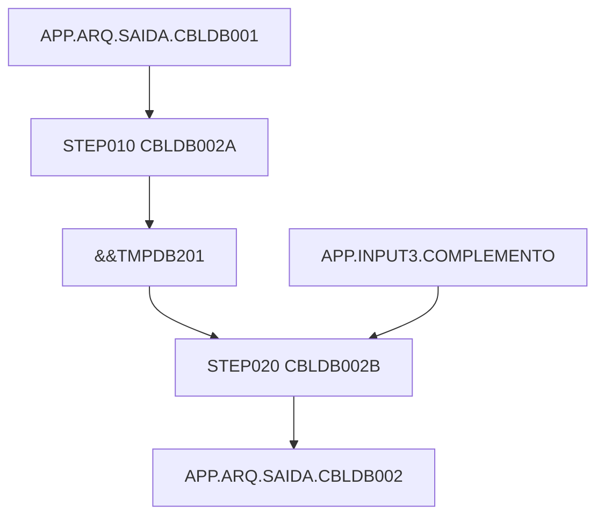
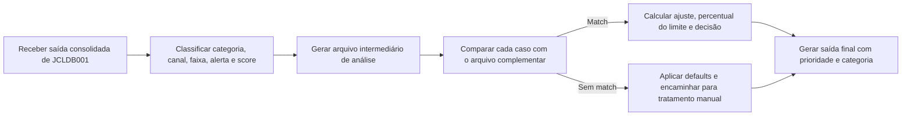
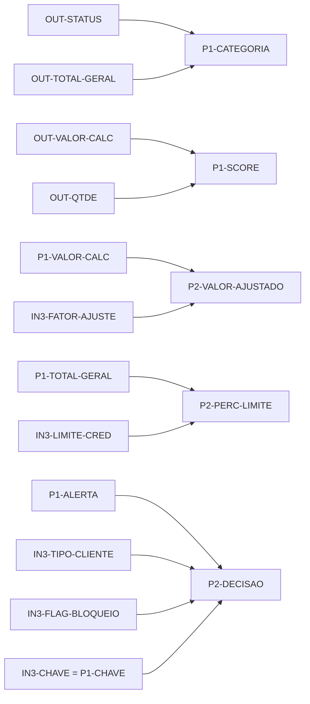

# JCLDB002 - documentação de negócio e lineage

## Sumário executivo

O job JCLDB002 faz o pós-processamento da saída produzida por JCLDB001 em duas etapas. A primeira etapa converte o layout operacional de 300 bytes em um layout analítico intermediário com score, categoria, faixa, alerta, mensagem de análise e agrupamento de canal. A segunda etapa cruza esse resultado com um arquivo complementar para produzir prioridade, decisão, valor ajustado, percentual do limite, categoria final e canal de destino.

O principal ponto de atenção do fluxo é que o cruzamento com o arquivo complementar é sequencial e simplificado. O programa compara a chave do registro corrente do intermediário com a chave do registro corrente do arquivo complementar e só avança o complemento quando há match. Isso significa que a qualidade funcional do resultado depende de alinhamento prévio entre os arquivos.

## Fluxo de negócio em linguagem simples

O fluxo recebe, como matéria-prima, os registros já enriquecidos e calculados no job anterior. Esses registros ainda representam um resultado operacional, mas não uma decisão final. A primeira etapa do JCLDB002 reinterpreta esse resultado em termos analíticos: define se o caso é VIP, ativo padrão ou bloqueado, agrupa o canal em digital ou agência, cria uma faixa de total, liga ou desliga um alerta e calcula um score simplificado.

Depois disso, o fluxo tenta cruzar cada caso com um arquivo complementar que traz segmento, fator de ajuste, limite de crédito, canal de referência, tipo de cliente, data de referência e flag de bloqueio. Quando há correspondência, o processo calcula um valor ajustado, mede o percentual de comprometimento do limite, decide se o caso vai para aprovação, bloqueio ou análise e define a prioridade de tratamento. Quando não há correspondência, o processo mantém o registro vivo, preenche defaults controlados e encaminha o caso para decisão manual.

Em linguagem de negócio, JCLDB002 pega um caso operacional já consolidado, acrescenta uma camada de segmentação e risco simplificado e publica uma saída pronta para encaminhamento ou triagem.

## Artefatos analisados

| Artefato | Tipo | Papel no fluxo |
| --- | --- | --- |
| mainframe/JCL/JCLDB002.jcl | JCL | Orquestra os dois programas COBOL e os datasets intermediários |
| mainframe/programas/CBLDB002A.cbl | COBOL | Reclassifica a saída de JCLDB001 em um layout analítico intermediário |
| mainframe/programas/CBLDB002B.cbl | COBOL | Cruza o intermediário com o arquivo complementar e publica a decisão final |
| mainframe/copybooks/CPYOUT01.cpy | Copybook | Layout de entrada do STEP010 |
| mainframe/copybooks/CPYDB201.cpy | Copybook | Layout intermediário gerado no STEP010 |
| mainframe/copybooks/CPYIN003.cpy | Copybook | Layout do arquivo complementar do STEP020 |
| mainframe/copybooks/CPYDB202.cpy | Copybook | Layout final do STEP020 |

## Fluxo de execução do JCL e dos steps

| Step | Programa | Entrada | Saída | Papel de negócio |
| --- | --- | --- | --- | --- |
| STEP010 | CBLDB002A | APP.ARQ.SAIDA.CBLDB001 | &&TMPDB201 | Traduz a saída operacional em um caso analítico intermediário |
| STEP020 | CBLDB002B | &&TMPDB201 e APP.INPUT3.COMPLEMENTO | APP.ARQ.SAIDA.CBLDB002 | Cruza com complemento e define a decisão final |

## Significado de negócio de cada step / ramo principal

### STEP010 - classificação analítica

Evidência observada:

- O programa move campos centrais da saída anterior para P1-CHAVE, P1-ORIGEM, P1-NOME, P1-STATUS, P1-TOTAL-GERAL, P1-VALOR-CALC e outros campos do layout REG-DB201.
- O programa define P1-CATEGORIA com base em OUT-STATUS e OUT-TOTAL-GERAL.
- O programa define P1-CANAL-GRUPO como DIGITAL quando OUT-CANAL-SAIDA é WE ou AP, ou quando OUT-ORIGEM é 2.
- O programa calcula P1-SCORE = (OUT-VALOR-CALC / 100) + OUT-QTDE.

Interpretação inferida:

- Essa etapa transforma o resultado operacional bruto em um retrato analítico resumido, apropriado para triagem, priorização ou decisão posterior.

nível de confiança: alto

### STEP020 - cruzamento com complemento

Evidência observada:

- O programa lê INPUTB uma vez na inicialização e volta a ler INPUTB apenas após um match bem-sucedido.
- A condição principal é IF NOT FIM-B AND IN3-CHAVE = P1-CHAVE.
- Sem match, o programa executa 2300-APLICA-DEFAULT.

Interpretação inferida:

- O cruzamento depende de sincronismo sequencial entre o arquivo intermediário e o complementar. Se a ordenação ou o alinhamento dos arquivos não estiver consistente, o fluxo tende a gerar falsos casos de não correspondência.

nível de confiança: alto

## Datasets, tabelas DB2, arquivos VSAM e utilities envolvidos

| Nome | Tipo | Uso no fluxo |
| --- | --- | --- |
| APP.ARQ.SAIDA.CBLDB001 | Arquivo sequencial FB 300 | Entrada principal do job |
| &&TMPDB201 | Temporário FB 320 | Saída intermediária do STEP010 |
| APP.INPUT3.COMPLEMENTO | Arquivo sequencial FB 80 | Fonte complementar para segmento, ajuste, limite e bloqueio |
| APP.ARQ.SAIDA.CBLDB002 | Arquivo sequencial FB 360 | Saída final do job |

### DB2

Evidência observada:

- Não há EXEC SQL em CBLDB002A nem em CBLDB002B.

Interpretação inferida:

- O job não consulta DB2; ele se apoia totalmente na saída do job anterior e no arquivo complementar sequencial.

nível de confiança: alto

### VSAM

Evidência observada:

- Não há instruções START, READ indexado, definição KSDS nem DD com padrão de VSAM no material analisado.

Interpretação inferida:

- O fluxo não usa VSAM.

nível de confiança: alto

### Utilities

Evidência observada:

- O JCL chama apenas programas COBOL; não há SORT ou outro utility entre os steps do job.

Interpretação inferida:

- Qualquer necessidade de ordenação do arquivo complementar precisa ser resolvida antes da execução de JCLDB002.

nível de confiança: médio

## Lineage dos campos relevantes

### Campo alvo: P1-CATEGORIA

- dataset de destino: &&TMPDB201
- origem(ns) upstream: OUT-STATUS e OUT-TOTAL-GERAL
- caminho upstream completo: STEP010 / CBLDB002A <- APP.ARQ.SAIDA.CBLDB001
- step e programa responsáveis: STEP010 / CBLDB002A
- regra ou transformação aplicável: atribuição condicional
- expressão ou trecho de evidência: IF OUT-STATUS = 'A' IF OUT-TOTAL-GERAL > 0000005000000 MOVE 'VIP' ELSE MOVE 'ATV' ELSE MOVE 'BLQ'
- classificação semântica da transformação: atribuição condicional
- propósito de negócio: sinalizar a relevância operacional do caso
- explicação orientada ao negócio: a categoria diferencia clientes ativos de maior impacto, ativos padrão e casos bloqueados
- explicação da regra em linguagem simples: um caso ativo e com total alto vira VIP; um caso ativo com total menor vira ATV; caso inativo vira BLQ
- exemplo(s) de entrada: STATUS A e TOTAL 80000,00
- exemplo(s) de lookup quando aplicável: não se aplica
- valor de saída no exemplo: VIP
- nível de confiança: alto

### Campo alvo: P1-SCORE

- dataset de destino: &&TMPDB201
- origem(ns) upstream: OUT-VALOR-CALC e OUT-QTDE
- caminho upstream completo: STEP010 / CBLDB002A <- APP.ARQ.SAIDA.CBLDB001
- step e programa responsáveis: STEP010 / CBLDB002A
- regra ou transformação aplicável: cálculo aritmético
- expressão ou trecho de evidência: COMPUTE WS-SCORE-AUX = (OUT-VALOR-CALC / 100) + OUT-QTDE
- classificação semântica da transformação: cálculo aritmético
- propósito de negócio: sintetizar intensidade do caso em um número simples
- explicação orientada ao negócio: o score cresce com o valor calculado e com a quantidade do caso
- explicação da regra em linguagem simples: divide o valor calculado por 100 e soma a quantidade
- exemplo(s) de entrada: OUT-VALOR-CALC 330,00 e OUT-QTDE 4
- exemplo(s) de lookup quando aplicável: não se aplica
- valor de saída no exemplo: 7
- nível de confiança: alto

### Campo alvo: P2-VALOR-AJUSTADO

- dataset de destino: APP.ARQ.SAIDA.CBLDB002
- origem(ns) upstream: P1-VALOR-CALC e IN3-FATOR-AJUSTE
- caminho upstream completo: STEP020 / CBLDB002B <- &&TMPDB201 + APP.INPUT3.COMPLEMENTO
- step e programa responsáveis: STEP020 / CBLDB002B
- regra ou transformação aplicável: cálculo aritmético
- expressão ou trecho de evidência: COMPUTE P2-VALOR-AJUSTADO = P1-VALOR-CALC * IN3-FATOR-AJUSTE
- classificação semântica da transformação: cálculo aritmético
- propósito de negócio: aplicar um ajuste complementar ao valor intermediário
- explicação orientada ao negócio: o valor vindo da etapa analítica é recalibrado por um fator externo do complemento
- explicação da regra em linguagem simples: multiplica o valor calculado do passo anterior pelo fator de ajuste do arquivo complementar
- exemplo(s) de entrada: P1-VALOR-CALC 330,00
- exemplo(s) de lookup quando aplicável: IN3-FATOR-AJUSTE 1,20
- valor de saída no exemplo: 396,00
- nível de confiança: alto

### Campo alvo: P2-PERC-LIMITE

- dataset de destino: APP.ARQ.SAIDA.CBLDB002
- origem(ns) upstream: P1-TOTAL-GERAL e IN3-LIMITE-CRED
- caminho upstream completo: STEP020 / CBLDB002B <- &&TMPDB201 + APP.INPUT3.COMPLEMENTO
- step e programa responsáveis: STEP020 / CBLDB002B
- regra ou transformação aplicável: cálculo aritmético condicional
- expressão ou trecho de evidência: IF IN3-LIMITE-CRED > ZEROES COMPUTE (P1-TOTAL-GERAL / IN3-LIMITE-CRED) * 100 ELSE MOVE ZERO
- classificação semântica da transformação: atribuição condicional com cálculo
- propósito de negócio: medir o comprometimento do total frente ao limite disponível
- explicação orientada ao negócio: o campo indica quanto do limite de crédito está sendo consumido pelo caso
- explicação da regra em linguagem simples: só calcula percentual quando existe limite positivo; caso contrário zera
- exemplo(s) de entrada: P1-TOTAL-GERAL 320,00
- exemplo(s) de lookup quando aplicável: IN3-LIMITE-CRED 1000,00
- valor de saída no exemplo: 32
- nível de confiança: alto

### Campo alvo: P2-DECISAO

- dataset de destino: APP.ARQ.SAIDA.CBLDB002
- origem(ns) upstream: IN3-TIPO-CLIENTE, P1-ALERTA, IN3-FLAG-BLOQUEIO e presença ou ausência de match
- caminho upstream completo: STEP020 / CBLDB002B
- step e programa responsáveis: STEP020 / CBLDB002B
- regra ou transformação aplicável: atribuição condicional
- expressão ou trecho de evidência:
  - Tipo cliente P + alerta N + flag bloqueio diferente de S -> APROVAR
  - Flag bloqueio S -> BLOQUEAR
  - Demais casos com match -> ANALISAR
  - Sem match -> MANUAL
- classificação semântica da transformação: atribuição condicional
- propósito de negócio: definir o encaminhamento final do caso
- explicação orientada ao negócio: a decisão final sintetiza elegibilidade, risco, bloqueio e existência de complemento
- explicação da regra em linguagem simples: só aprova automaticamente casos elegíveis e sem bloqueio; o restante bloqueia, analisa ou vai para manual
- exemplo(s) de entrada: P1-ALERTA N
- exemplo(s) de lookup quando aplicável: IN3-TIPO-CLIENTE P e IN3-FLAG-BLOQUEIO N
- valor de saída no exemplo: APROVAR
- nível de confiança: alto

## Regras de negócio identificadas

| Regra | Tipo | Descrição de negócio |
| --- | --- | --- |
| R1 | reformatação sem mudança semântica | Campos centrais de JCLDB001 são transportados para o layout intermediário P1 |
| R2 | atribuição condicional | P1-CATEGORIA depende de status e total |
| R3 | atribuição condicional | P1-CANAL-GRUPO consolida canais em DIGITAL ou AGENCIA |
| R4 | atribuição condicional | P1-FAIXA-TOTAL assume A1, B1 ou C1 conforme o total |
| R5 | atribuição condicional | P1-ALERTA vale N apenas quando ocorrência é 000 e status é A |
| R6 | cálculo aritmético | P1-SCORE usa valor calculado e quantidade |
| R7 | uso de chave de busca | STEP020 compara IN3-CHAVE com P1-CHAVE para definir match |
| R8 | cálculo aritmético | P2-VALOR-AJUSTADO e P2-PERC-LIMITE dependem do complemento |
| R9 | atribuição condicional | P2-CANAL-DESTINO, P2-FLAG-CROSS, P2-PRIORIDADE, P2-DECISAO e P2-CATEGORIA-FINAL dependem das condições do match |
| R10 | constante / hard code | Sem match, o fluxo gera defaults controlados e decisão MANUAL |

## Exemplos práticos com valores de campos

### Exemplo prático 1 - classificação do intermediário

Valores de entrada:

- OUT-STATUS = A
- OUT-TOTAL-GERAL = 80000,00
- OUT-CANAL-SAIDA = WE
- OUT-ORIGEM = 2
- OUT-OCORRENCIA = 000
- OUT-VALOR-CALC = 330,00
- OUT-QTDE = 4

Regra aplicada:

- P1-CATEGORIA = VIP
- P1-CANAL-GRUPO = DIGITAL
- P1-FAIXA-TOTAL = A1
- P1-ALERTA = N
- P1-SCORE = 330 / 100 + 4 = 7

Resultado final:

- O caso segue para o arquivo intermediário como registro prioritário e sem alerta.

Visão de negócio:

- Um caso ativo, digital e de alto valor passa a receber tratamento prioritário já na camada analítica.

### Exemplo prático 2 - match com complemento e aprovação

Valores de entrada:

- P1-CHAVE = 0000005678
- P1-VALOR-CALC = 330,00
- P1-TOTAL-GERAL = 320,00
- P1-ALERTA = N
- P1-CANAL-GRUPO = DIGITAL

Valores de lookup:

- IN3-CHAVE = 0000005678
- IN3-FATOR-AJUSTE = 1,20
- IN3-LIMITE-CRED = 1000,00
- IN3-TIPO-CLIENTE = P
- IN3-FLAG-BLOQUEIO = N

Regra aplicada:

- P2-VALOR-AJUSTADO = 396,00
- P2-PERC-LIMITE = 32
- P2-CANAL-DESTINO = WB
- P2-FLAG-CROSS = N
- P2-PRIORIDADE = A
- P2-DECISAO = APROVAR
- P2-CATEGORIA-FINAL = PRM

Resultado final:

- O caso sai aprovado de forma automática.

Visão de negócio:

- Quando o complemento confirma elegibilidade, ausência de bloqueio e perfil adequado, o fluxo elimina necessidade de triagem manual.

### Exemplo prático 3 - sem correspondência no complemento

Valores de entrada:

- P1-CHAVE = 0000009999
- Registro corrente de INPUTB com chave diferente ou fim de arquivo

Regra aplicada:

- P2-SEGMENTO = 000
- P2-LIMITE-CRED = 0
- P2-VALOR-AJUSTADO = 0
- P2-PRIORIDADE = D
- P2-DECISAO = MANUAL

Resultado final:

- O caso é mantido na saída, porém marcado para tratamento manual.

Visão de negócio:

- A ausência de complemento não destrói o caso; ela apenas muda seu encaminhamento.

## Hard codes e constantes

| Campo | Valor | Classificação | Papel de negócio | nível de confiança |
| --- | --- | --- | --- | --- |
| P1-COD-PROCESSO | P1-JCLDB2A | constante literal | Identifica o processo que montou o intermediário | alto |
| P1-CANAL-GRUPO | DIGITAL ou AGENCIA | constante condicional | Resume diferentes canais em dois grupos de negócio | alto |
| P1-CATEGORIA | VIP, ATV, BLQ | constante condicional | Resume o status analítico do caso | alto |
| P1-FAIXA-TOTAL | A1, B1, C1 | constante condicional | Classifica a faixa de valor do total | alto |
| P2-PRIORIDADE | A, B, C, D | constante condicional | Indica urgência operacional do caso final | alto |
| P2-DECISAO | APROVAR, BLOQUEAR, ANALISAR, MANUAL | constante condicional | Define o encaminhamento final do caso | alto |
| P2-CATEGORIA-FINAL | PRM, BLK ou categoria P1 | constante condicional | Materializa a categoria final de saída | alto |

## Pontos de lookup em DB2 / VSAM

Evidência observada:

- Não há lookup em DB2.
- Não há lookup VSAM.
- O único lookup funcional é a comparação sequencial entre P1-CHAVE e IN3-CHAVE.

Interpretação inferida:

- O papel de lookup neste job é exercido pelo próprio arquivo complementar, que funciona como fonte externa sequencial de segmentação e decisão.

nível de confiança: alto

## Decisões condicionais e derivações

| Condição | Resultado | Efeito de negócio |
| --- | --- | --- |
| STATUS A e TOTAL > 50000,00 | P1-CATEGORIA = VIP | Caso ativo de maior relevância |
| STATUS A e TOTAL <= 50000,00 | P1-CATEGORIA = ATV | Caso ativo padrão |
| STATUS diferente de A | P1-CATEGORIA = BLQ | Caso tratado como bloqueado |
| CANAL WE ou AP, ou ORIGEM 2 | P1-CANAL-GRUPO = DIGITAL | Consolida canais digitais |
| OCORRENCIA 000 e STATUS A | P1-ALERTA = N | Caso sem alerta inicial |
| Match e CANAL-GRUPO DIGITAL | P2-CANAL-DESTINO = WB | Encaminha caso digital para destino web |
| P1-TOTAL-GERAL > IN3-LIMITE-CRED | P2-FLAG-CROSS = S | Sinaliza extrapolação do limite |
| Tipo cliente P, sem alerta e sem bloqueio | P2-DECISAO = APROVAR | Elegibilidade automática |
| Flag bloqueio S | P2-DECISAO = BLOQUEAR | Interrupção por bloqueio |
| Sem match | P2-DECISAO = MANUAL | Encaminhamento manual por ausência de complemento |

## Lacunas, inferências e notas de confiança

| Tema | Evidência observada | Interpretação inferida | nível de confiança |
| --- | --- | --- | --- |
| Match entre INPUTA e INPUTB | INPUTB só avança após match | O fluxo depende de alinhamento sequencial por chave | alto |
| Ordenação prévia de INPUT3 | Não há SORT no JCLDB002 | O arquivo complementar precisa chegar previamente ordenado ou alinhado | médio |
| Natureza do score | Fórmula simples no COBOL | O score é um indicador sintético e não um modelo estatístico sofisticado | médio |
| Tratamento sem match | Defaults em 2300-APLICA-DEFAULT | O job privilegia preservação do caso para fila manual | alto |

