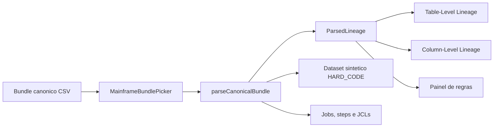

# Mainframe Lineage Viewer

Esta documentacao descreve o Mainframe Lineage Viewer atual, com foco principal no pacote de CSVs que alimenta a pagina de lineage de mainframe. O objetivo aqui e servir como material de apresentacao: explicar o sistema, mostrar como a pagina foi pensada e detalhar exatamente o que cada CSV e cada campo representam dentro do contexto do viewer.

## Resumo executivo

O Mainframe Lineage Viewer e uma aplicacao Next.js orientada a exploracao visual de lineage. A pagina principal e a rota `/mainframe`, que carrega um bundle canonico em CSV, converte esse bundle para um modelo interno de lineage e renderiza tres camadas de leitura:

1. um grafo de table-level lineage
2. um grafo de column-level lineage
3. um painel de regras e evidencias para os campos selecionados

Do ponto de vista da apresentacao, a mensagem principal e simples:

- o extractor transforma conhecimento de JCL, COBOL, copybook e DCLGEN em um bundle CSV canonico
- o viewer consome esse bundle sem depender de catalogos externos
- a UI transforma os CSVs em uma narrativa visual sobre datasets, steps, regras de transformacao, evidencias e origem de cada coluna

## O que o sistema entrega

O site possui uma navegacao pequena e objetiva:

- `/` redireciona para `/mainframe`
- `/mainframe` e a experiencia principal baseada em CSV para linhagem de mainframe
- `/openlineage` e uma visao paralela para eventos OpenLineage
- `/fabric-livy` e outra experiencia analitica do repositorio

Para a sua apresentacao, a pagina que importa e a de mainframe, porque e nela que o CSV vira produto visual.

## Stack e desenho da solucao

- frontend em Next.js 15 com React 18
- grafos com React Flow e dagre
- carga local de bundles via CSV solto ou ZIP
- persistencia local em IndexedDB para bundles carregados
- filtro de JCL ativo salvo em localStorage
- exportacao em PDF da visao de lineage
- exportacao em dois workbooks Excel: um detalhado para linhagem e regras dos campos selecionados, e um executivo para classificacao dos campos

## Fluxo conceitual

Leitura pratica do diagrama:

- o bundle chega pela UI
- o parser transforma os CSVs em datasets, arestas, jobs, regras, artifacts e evidencias
- a pagina usa esse modelo unico para alimentar todos os paineis
- regras de constante viram tambem uma origem sintetica chamada `HARD_CODE`, o que torna a origem literal visivel no grafo

## Como a pagina foi pensada

O desenho da tela principal segue uma logica de leitura progressiva:

### 1. Cabecalho operacional

O topo da pagina existe para controlar o bundle e a sessao:

- adicionar um ou varios bundles por ZIP ou CSVs soltos
- usar a amostra JCLDB001
- listar JCLs carregados
- filtrar por um JCL especifico
- limpar filtro
- exportar PDF
- limpar todos os bundles
- mostrar indicadores resumidos: datasets, steps, table edges, column edges, artifacts e JCL ativo

### 2. Table-Level Lineage

Esta secao responde a pergunta: qual dataset passa por qual step e chega a qual destino?

- datasets aparecem como cards
- steps aparecem como jobs intermediarios
- a cor comunica papel logico: source, intermediate, target
- quando `steps.csv` existe, o no de job mostra step, programa, plano e contexto do JCL

### 3. Column-Level Lineage

Esta e a secao mais importante da experiencia:

- cada dataset vira um card com todas as colunas
- clicar em uma coluna destaca upstream e downstream completos
- o usuario pode selecionar varias colunas ao mesmo tempo
- ha filtro por transformacao padronizada
- ha filtro por nome de coluna
- quando `steps.csv` existe, as arestas carregam tambem o step associado

### 4. Painel de regras

Esta secao fecha a explicacao tecnica do lineage:

- mostra as regras explicitas do campo selecionado
- herda regras de upstream quando necessario
- exibe `rule_id`, `step_id`, tipo bruto, transformacao padronizada e programa
- exibe expressao e descricao
- quando `evidence.csv` e `artifacts.csv` existem, mostra provas textuais com localizacao e artefato de origem
- permite exportar um Excel detalhado da selecao e um Excel executivo de classificacao

### 5. Dois workbooks Excel com leituras diferentes

O viewer agora expoe dois exports no painel de regras, e eles atendem perguntas diferentes.

| Workbook | Quando usar | Escopo real no viewer |
| --- | --- | --- |
| `Exportar Excel detalhado` | quando a leitura precisa mostrar a trilha upstream, as regras explicitas e a evidencia tecnica dos campos selecionados | so aparece quando existe selecao de campos e exporta apenas a selecao atual |
| `Exportar Excel de classificacao` | quando a leitura precisa responder rapidamente, em apresentacao ou auditoria, se um campo veio direto da origem, usa hard code ou foi gerado no fluxo | se houver selecao, exporta a selecao atual; se nao houver, exporta os campos visiveis do filtro JCL atual |

O Excel de classificacao nao substitui o Excel detalhado. O primeiro resume a resposta executiva por campo; o segundo continua sendo o material de trilha tecnica.

### Como ler o workbook executivo de classificacao

O workbook executivo responde tres perguntas objetivas por campo e aplica uma prioridade fixa quando ha sinais mistos: `hard_code > gerado_fluxo > direto_origem`.

| Categoria principal | Definicao objetiva | Como ler na pratica |
| --- | --- | --- |
| `direto_origem` | o campo tem linhagem resolvida e so preserva identidade ou reordenacao, sem sinal de hard code nem transformacao geradora | use quando quiser afirmar que o valor veio da origem sem mudanca substantiva |
| `hard_code` | o campo recebe constante literal ou constante condicional em algum ponto relevante do lineage | inclui tanto hard code direto quanto hard code indireto herdado de upstream |
| `gerado_fluxo` | o campo e produzido por transformacao local nao identitaria, por lookup, calculo, derivacao condicional, enriquecimento ou ficou sem upstream resolvido | use quando o valor nasce ou e fechado dentro do fluxo, e nao como copia simples da origem |

Os motivos detalhados existem para auditoria curta. Eles refinam a categoria principal sem trocar a resposta executiva:

- `copia_identidade` e `reordenacao_registro` sustentam a leitura de `direto_origem`
- `hard_code_direto` significa constante no proprio campo; `hard_code_indireto` significa que o campo depende de um upstream que ja trouxe constante
- `calculo_derivado`, `derivacao_condicional`, `busca_valor`, `uso_chave_busca` e `copia_enriquecimento_registro` sustentam a leitura de `gerado_fluxo`
- `gerado_sem_upstream` marca o caso em que o viewer ainda nao encontrou upstream resolvido para o campo; para leitura executiva, ele continua contado como gerado no fluxo e nao como origem direta

Leitura recomendada para apresentacao e auditoria:

- use o Excel de classificacao para responder as tres perguntas de negocio sem navegar campo a campo no grafo
- abra o Excel detalhado quando precisar defender a resposta com regra, step, origem upstream e evidencia textual
- quando aparecer `sinal_hard_code_indireto = Sim`, leia isso como dependencia herdada de constante, mesmo que a ultima regra do campo nao seja uma constante literal
- quando aparecer `gerado_sem_upstream`, leia como campo ainda fechado localmente pelo viewer, sem evidenciar origem resolvida ate aquele ponto do lineage

## Escopo real dos CSVs no viewer

O ponto mais importante para sua apresentacao e este:

### CSVs que a pagina Mainframe consome diretamente

Arquivos obrigatorios:

- `entities.csv`
- `entity_columns.csv`
- `column_mappings.csv`
- `transform_rules.csv`

Arquivos opcionais, mas muito importantes para enriquecer a demonstracao:

- `steps.csv`
- `artifacts.csv`
- `evidence.csv`

### Nota sobre a amostra JCLDB001 servida pela UI

- o botao `Carregar amostra JCLDB001` le diretamente a copia estatica publicada em `mainframe-lineage-viewer/public/mainframe-sample`
- a pasta `generated/mainframe-extractor/JCLDB001/importar` continua sendo a referencia canonica do bundle, mas nao e carregada pelo navegador de forma direta
- a amostra publica agora combina duas camadas: a espinha dorsal do fluxo real de `JCLDB001` e uma camada didatica controlada formada pela familia `DEMO-ID`, `DEMO-ORD`, `DEMO-ENR`, `DEMO-LKP`, `DEMO-KEY`, `DEMO-CALC`, `DEMO-DER`, `DEMO-COND`, `DEMO-FIXO`, `DEMO-RAW`, `DEMO-NULL1`, `DEMO-NULL2` e `DEMO-FILL`
- a convencao de nomes curtos faz parte do contrato da demo: todo campo demonstrativo comeca com `DEMO-` e usa siglas compactas para caber nos cards, nos filtros e nos exports sem inflar a leitura
- na matriz didatica contratual, os 10 campos da trilha `taxonomy` continuam sendo a cobertura oficial de `rule_subtype`, enquanto a trilha `null` usa `null_status` para narrar `sem_upstream`, `propagado` e `resolvido`
- na materializacao do bundle canonico, `DEMO-NULL2` e `DEMO-FILL` tambem reutilizam subtipos padronizados ja existentes para sustentar a propagacao e a resolucao visual do lineage: `DEMO-NULL2` propaga vazio com `copia_identidade`, `DEMO-FILL` primeiro propaga vazio com `copia_identidade` e depois fecha a trilha com `constante_condicional`; isso nao cria novos subtipos, apenas reaproveita a taxonomia padronizada fora da trilha principal de cobertura
- esse comportamento deve ser lido como demonstracao controlada do viewer, nao como extracao literal de uma regra real do COBOL ou do JCL de `JCLDB001`

### Familia DEMO e roteiro didatico da taxonomia

| Campo DEMO | Papel didatico | Leitura recomendada na apresentacao |
| --- | --- | --- |
| `DEMO-ID` | `copia_identidade` | exemplo de copia 1:1 entre origem e destino, sem regra adicional |
| `DEMO-ORD` | `reordenacao_registro` | exemplo de campo que atravessa o SORT e preserva o valor apos a reordenacao |
| `DEMO-ENR` | `copia_enriquecimento_registro` | exemplo de copia final com enriquecimento no ultimo passo |
| `DEMO-LKP` | `busca_valor` | exemplo de valor que entra no lineage por lookup DB2 |
| `DEMO-KEY` | `uso_chave_busca` | exemplo de campo usado como chave de pesquisa do lookup |
| `DEMO-CALC` | `calculo_derivado` | exemplo de calculo com multiplas origens reais |
| `DEMO-DER` | `derivacao_condicional` | exemplo de derivacao que escolhe entre upstreams conforme condicao |
| `DEMO-COND` | `constante_condicional` | exemplo de condicao que escolhe entre literais curtos |
| `DEMO-FIXO` | `constante_literal` | exemplo de valor literal que nasce como `HARD_CODE` |
| `DEMO-RAW` | `nao_classificada` | exemplo propositalmente mantido fora da taxonomia analitica |
| `DEMO-NULL1` | `null_status=sem_upstream` | campo presente no schema sem mapping real; deve aparecer como vazio sem ser lido como erro do fluxo real |
| `DEMO-NULL2` | `null_status=propagado` + reutiliza `copia_identidade` no bundle | mesmo vazio propagado para a etapa seguinte, ainda sem upstream real |
| `DEMO-FILL` | `null_status=resolvido` + reutiliza `copia_identidade` e `constante_condicional` no bundle | trilha que nasce vazia, propaga esse vazio e so fica resolvida na regra final da saida |

Leitura pratica para evitar confusao:

- apresente primeiro a narrativa real do job com `INPUT1`, `INPUT2`, `DB2`, `&&TMPOUT03` e `APP.ARQ.SAIDA.CBLDB001`
- depois mostre a camada didatica como um overlay controlado, usando a familia `DEMO-*` apenas para explicar os filtros e a taxonomia do viewer
- se surgir a pergunta sobre `rule_subtype`, diferencie o contrato didatico da materializacao: a cobertura oficial da taxonomia continua concentrada em `DEMO-ID` ate `DEMO-RAW`, mas o bundle reaproveita `copia_identidade` e `constante_condicional` em `DEMO-NULL2` e `DEMO-FILL` para que a trilha visual de propagacao e resolucao exista de fato no grafo
- ao falar da trilha null, trate `DEMO-NULL1`, `DEMO-NULL2` e `DEMO-FILL` como narrativa visual de status, nao como evidencias de que o COBOL real possui tres regras extras

### CSVs que existem no bundle gerado, mas nao sao a fonte primaria desta tela

Arquivos como `jobs.csv`, `step_inputs.csv`, `step_outputs.csv`, `openlineage_jobs.csv`, `openlineage_inputs.csv`, `openlineage_outputs.csv`, `openlineage_runs.csv` e `openlineage_column_lineage.csv` existem para interoperabilidade, rastreabilidade operacional e geracao de `openlineage.jsonl`. Eles ajudam a explicar o ecossistema do extractor, mas a tela `/mainframe` nao os le diretamente hoje.

## Mapeamento direto: CSV para experiencia visual

| CSV | O que representa | Como o viewer usa |
| --- | --- | --- |
| `entities.csv` | catalogo de entidades de dados | cria datasets e define nome, namespace, tipo e observacoes |
| `entity_columns.csv` | schema de cada entidade | cria os campos mostrados nos cards e compoe o tipo de dado exibido internamente |
| `column_mappings.csv` | ligacoes coluna-origem para coluna-destino | cria as arestas do lineage de coluna e participa do lineage de tabela |
| `transform_rules.csv` | regras de negocio/transformacao | alimenta o painel de regras e padroniza a taxonomia de transformacoes |
| `steps.csv` | catalogo de steps do job | cria contexto de job, step, programa, DDs e filtro por JCL |
| `artifacts.csv` | inventario de artefatos fonte | da nome e caminho para evidencias e aumenta o contexto de auditoria |
| `evidence.csv` | provas textuais do extractor | mostra trechos de JCL, COBOL, copybook e DCLGEN no painel de regras |

## Dicionario detalhado dos CSVs canonicos

Nesta secao, cada CSV e explicado em duas camadas:

- o significado do campo no bundle
- o efeito pratico desse campo dentro da pagina

## 1. `entities.csv`

### `entities.csv`: o que representa

E o cadastro das entidades de dados do bundle. Cada linha identifica um dataset fisico, dataset temporario, tabela DB2 ou entidade sintetica tratada pelo extractor.

### `entities.csv`: papel na tela

- define quais cards de dataset vao existir
- ajuda a determinar o namespace visual, como `mainframe://dataset` ou `mainframe://db2`
- contribui para o papel source, intermediate ou target depois que os mappings sao analisados

### `entities.csv`: campos

| Campo | Exemplo | Significado no bundle | Uso atual no viewer |
| --- | --- | --- | --- |
| `entity_id` | `E001` | identificador estavel da entidade | usado como chave de relacionamento com colunas e mappings |
| `entity_name` | `APP.INPUT1.ORIGINAL` | nome de negocio ou nome fisico da entidade | vira o nome exibido do dataset |
| `entity_type` | `dataset`, `temp_dataset`, `db2_table` | classifica a natureza da entidade | armazenado como contexto do dataset |
| `system` | `mainframe`, `db2` | informa o sistema de origem | define o namespace do dataset |
| `record_format` | `FB` | formato fisico do dataset | hoje nao e exibido nem parseado pela tela |
| `lrecl` | `80` | comprimento logico do registro | hoje nao e exibido nem parseado pela tela |
| `source_artifact_id` | `A001` | artefato que sustenta a definicao da entidade | hoje nao e parseado pela tela |
| `notes` | texto livre | observacao complementar sobre a entidade | parseado e mantido como observacao do dataset |

### `entities.csv`: leitura de negocio

Se voce precisar resumir este arquivo em uma frase: `entities.csv` responde a pergunta "quais objetos de dados existem neste fluxo?".

## 2. `entity_columns.csv`

### `entity_columns.csv`: o que representa

E o schema canonico das entidades. Cada linha representa uma coluna de uma entidade.

### `entity_columns.csv`: papel na tela

- popula a lista de colunas dentro de cada card
- monta o tipo visual do campo usando `data_type`, `length` e `scale`
- preserva `source_definition` como descricao tecnica da coluna

### `entity_columns.csv`: campos

| Campo | Exemplo | Significado no bundle | Uso atual no viewer |
| --- | --- | --- | --- |
| `column_id` | `C001` | identificador estavel da coluna | hoje nao e usado pela tela |
| `entity_id` | `E001` | referencia para a entidade dona da coluna | usado para agrupar colunas por dataset |
| `column_name` | `IN1-CHAVE` | nome da coluna | aparece no card e nas arestas de lineage |
| `data_type` | `CHAR`, `NUMERIC` | tipo base do campo | compoe o tipo interno do schema |
| `length` | `10` | tamanho do campo | compoe o tipo interno, por exemplo `CHAR(10)` |
| `scale` | `2` | casas decimais para numericos | compoe o tipo interno, por exemplo `NUMERIC(5,2)` |
| `nullable` | `false` | nulabilidade logica | hoje nao e usado pela tela |
| `source_artifact_id` | `A003` | artefato fonte da definicao do campo | hoje nao e usado pela tela |
| `source_definition` | `PIC X(10)` | definicao original do copybook ou schema | vira descricao do campo no modelo interno |

### `entity_columns.csv`: leitura de negocio

Se `entities.csv` diz quais objetos existem, `entity_columns.csv` diz "como cada objeto e estruturado por dentro".

## 3. `column_mappings.csv`

### `column_mappings.csv`: o que representa

E o coracao do lineage de colunas. Cada linha diz que uma coluna de origem participa da construcao de uma coluna de destino em um determinado step, possivelmente associada a uma regra.

### `column_mappings.csv`: papel na tela

- cria as arestas do column-level lineage
- participa da montagem do table-level lineage
- relaciona a ligacao tecnica de colunas com a regra de transformacao correspondente

### `column_mappings.csv`: campos

| Campo | Exemplo | Significado no bundle | Uso atual no viewer |
| --- | --- | --- | --- |
| `mapping_id` | `M001` | identificador da ligacao entre colunas | parseado, mas hoje nao e exibido diretamente |
| `step_id` | `S001` | step onde a ligacao acontece | usado para amarrar o mapping ao contexto do step |
| `mapping_group_id` | `G001` | agrupador de mappings semanticamente relacionados | hoje nao e usado pela tela |
| `source_entity_id` | `E001` | entidade de origem | usado para localizar o dataset de origem |
| `source_column_name` | `IN1-CHAVE` | coluna de origem | vira a ponta source da aresta |
| `target_entity_id` | `E002` | entidade de destino | usado para localizar o dataset de destino |
| `target_column_name` | `IN1-CHAVE` | coluna de destino | vira a ponta target da aresta |
| `rule_id` | `R001` | regra associada ao mapping | conecta o mapping ao detalhamento de `transform_rules.csv` |
| `expression` | `IN1-CHAVE -> IN1-CHAVE` | expressao resumida da ligacao | usada como fallback de contexto quando necessario |
| `confidence` | `high` | confianca da extracao | hoje nao e usado pela tela |

### `column_mappings.csv`: leitura de negocio

Este arquivo responde a pergunta: "de qual coluna veio esta outra coluna?".

## 4. `transform_rules.csv`

### `transform_rules.csv`: o que representa

E a camada semantica do lineage. Enquanto `column_mappings.csv` mostra a conexao estrutural entre colunas, `transform_rules.csv` explica o tipo de transformacao e a regra aplicada.

### `transform_rules.csv`: papel na tela

- alimenta o painel de regras
- padroniza a leitura para categorias de negocio, como copia de identidade, calculo derivado ou busca de valor
- cria arestas sinteticas de `HARD_CODE` quando a regra representa constante literal ou constante condicional

### `transform_rules.csv`: campos

| Campo | Exemplo | Significado no bundle | Uso atual no viewer |
| --- | --- | --- | --- |
| `rule_id` | `R015` | identificador unico da regra | exibido no painel de regras |
| `step_id` | `S003` | step onde a regra acontece | conecta a regra ao contexto operacional |
| `rule_type` | `move`, `compute`, `db_lookup`, `conditional`, `sort`, `copy`, `constant` | familia tecnica bruta da regra | exibida como classificacao tecnica |
| `rule_subtype` | `copia_identidade`, `calculo_derivado`, `busca_valor` | classificacao semantica normalizada | usada como taxonomia padronizada da interface |
| `target_entity_id` | `E006` | entidade de destino da regra | localiza o campo que recebe a regra |
| `target_column_name` | `OUT-VALOR-CALC` | coluna de destino | ancora a regra ao campo certo |
| `expression` | `HV-VALOR-BASE * IN1-FATOR` | expressao operacional da regra | exibida no painel e usada para inferencias em constantes |
| `description` | texto livre | descricao em linguagem natural | exibida como explicacao humana da regra |

### `transform_rules.csv`: leitura de negocio

Este CSV responde a pergunta: "qual transformacao aconteceu e por que ela faz sentido?".

## 5. `steps.csv`

### `steps.csv`: o que representa

E o catalogo de execucao do job. Cada linha representa um step do fluxo batch.

### `steps.csv`: papel na tela

- cria os nos de job no table-level lineage
- enriquece as arestas com nome de step
- habilita a filtragem por JCL
- mostra programa, tipo de step, plano, DDs de entrada e DDs de saida

### `steps.csv`: campos

| Campo | Exemplo | Significado no bundle | Uso atual no viewer |
| --- | --- | --- | --- |
| `step_id` | `S003` | identificador do step | chave primaria para ligar mappings e rules |
| `job_id` | `J001` | job ao qual o step pertence | ajuda a resolver o JCL logico quando necessario |
| `step_name` | `STEP030` | nome operacional do step | exibido nos nos de job e no painel de regras |
| `sequence` | `30` | ordem de execucao | hoje nao e exibido diretamente |
| `program_name` | `CBLDB001` | programa efetivamente executado | exibido no contexto do step |
| `step_type` | `cobol_db2`, `sort`, `copy` | natureza do step | exibido como contexto operacional |
| `jcl_program` | `IKJEFT01`, `SORT` | programa JCL invocado | usado como fallback de contexto |
| `plan_name` | `PLNDB001` | plano DB2 ou contexto equivalente | exibido quando existe |
| `input_ddnames` | `INPUT1,INPUT2,SQL:APPDB.CLIENTE_MOVTO` | entradas logicas do step | armazenado e exportado no contexto do job |
| `output_ddnames` | `SAIDA` | saidas logicas do step | armazenado e exportado no contexto do job |

### `steps.csv`: leitura de negocio

Este arquivo responde a pergunta: "em qual etapa do batch a transformacao aconteceu?".

## 6. `artifacts.csv`

### `artifacts.csv`: o que representa

E o inventario dos artefatos tecnicos usados pelo extractor para sustentar o lineage: JCL, programa COBOL, copybooks, DCLGEN e outros componentes.

### `artifacts.csv`: papel na tela

- permite mostrar o nome do artefato ligado a uma evidencia
- enriquece o contexto de auditoria no painel de regras
- alimenta o contador de artifacts no topo da pagina

### `artifacts.csv`: campos

| Campo | Exemplo | Significado no bundle | Uso atual no viewer |
| --- | --- | --- | --- |
| `artifact_id` | `A001` | identificador do artefato | usado para relacionar evidencias |
| `artifact_type` | `JCL`, `PROGRAM`, `COPYBOOK`, `DCLGEN` | tipo tecnico do artefato | exibido no detalhe da evidencia |
| `name` | `JCLDB001`, `CBLDB001` | nome amigavel do artefato | aparece como badge no painel |
| `path` | `JCL/JCLDB001.jcl` | caminho relativo no repositorio | exibido no detalhe da evidencia |
| `role` | `job_control`, `main_program`, `input_schema` | papel do artefato na extracao | usado para resolver nomes de JCL e contexto |
| `notes` | texto livre | explicacao complementar | armazenado no modelo e pode apoiar leitura futura |

### `artifacts.csv`: leitura de negocio

Este arquivo responde a pergunta: "de onde veio a prova tecnica do lineage?".

## 7. `evidence.csv`

### `evidence.csv`: o que representa

E a trilha de prova do extractor. Cada linha aponta para um trecho especifico de JCL, COBOL, copybook ou DCLGEN que sustenta uma entidade, um mapping, um step, uma regra ou um artefato.

### `evidence.csv`: papel na tela

- mostra trechos textuais no painel de regras
- informa localizacao exata do trecho analisado
- permite defender o lineage em auditoria, debug e apresentacao tecnica

### `evidence.csv`: campos

| Campo | Exemplo | Significado no bundle | Uso atual no viewer |
| --- | --- | --- | --- |
| `evidence_id` | `EV012` | identificador unico da evidencia | chave da prova exibida |
| `related_type` | `step`, `entity`, `mapping`, `artifact`, `rule` | tipo do objeto ao qual a evidencia se refere | usado para organizar a associacao |
| `related_id` | `S003`, `M021`, `R015` | identificador do objeto relacionado | usado para localizar a prova |
| `artifact_id` | `A002` | artefato onde a prova foi encontrada | permite anexar nome, tipo e caminho do artefato |
| `location` | `programas/CBLDB001.cbl:86` | localizacao do trecho fonte | exibido no painel |
| `excerpt` | `MOVE IN1-CHAVE TO OUT-CHAVE` | trecho extraido da fonte | exibido como prova textual |
| `confidence` | `high` | confianca da evidencia | exibido como badge |

### `evidence.csv`: leitura de negocio

Este CSV responde a pergunta: "qual prova concreta sustenta essa afirmacao de lineage?".

## Taxonomia de transformacoes padronizadas

O viewer traduz `rule_type` e `rule_subtype` para uma taxonomia semantica de negocio. Isso e importante na apresentacao porque tira o foco de detalhe tecnico bruto e coloca o foco no sentido da transformacao.

| Chave padronizada | Rotulo na interface | Leitura de negocio |
| --- | --- | --- |
| `copia_identidade` | Copia de identidade | o valor foi copiado sem alterar semantica |
| `reordenacao_registro` | Reordenacao de registro | os registros mudaram de ordem, nao de conteudo |
| `copia_enriquecimento_registro` | Copia com enriquecimento | o registro foi majoritariamente copiado, mas houve complemento |
| `busca_valor` | Busca de valor | o valor veio de fonte externa, tipicamente DB2 |
| `uso_chave_busca` | Uso de chave de busca | o campo serviu para localizar dado externo |
| `calculo_derivado` | Calculo derivado | o valor resultou de formula ou operacao numerica |
| `derivacao_condicional` | Derivacao condicional | o valor dependeu de logica condicional baseada em dados |
| `constante_condicional` | Constante condicional | um literal foi escolhido por ramo de decisao |
| `constante_literal` | Constante literal | um literal fixo foi atribuido ao campo |
| `nao_classificada` | Transformacao nao classificada | a regra ainda nao foi enquadrada na taxonomia |

## Como o viewer interpreta campos especiais

### `HARD_CODE`

Quando uma regra e reconhecida como constante literal ou constante condicional, o viewer cria um dataset sintetico chamado `HARD_CODE`.

Isso resolve um problema de apresentacao muito comum: sem esse no sintetico, a coluna de destino pareceria surgir do nada. Com `HARD_CODE`, a interface mostra explicitamente que a origem do valor foi um literal.

### Regras herdadas

O painel de regras nao mostra apenas a regra direta do campo selecionado. Ele tambem pode caminhar para upstream e herdar regras relevantes. Isso e especialmente util quando o campo final foi construido sobre uma cadeia de derivacoes.

### Papel `source`, `intermediate` e `target`

Esses papeis nao vem prontos do CSV. O viewer os calcula observando se o dataset aparece como entrada, saida ou ambos no conjunto de mappings.

## O que ainda existe no bundle gerado fora da tela principal

Para sua apresentacao, vale mostrar que o sistema nao termina no viewer. O extractor gera tambem CSVs derivados para interoperabilidade e reconstrucao de OpenLineage.

### `jobs.csv`

- representa o job logico consolidado
- exemplo de colunas: `job_id`, `job_name`, `jcl_artifact_id`, `system`, `subsystem`, `description`
- uso atual: contexto de bundle e interoperabilidade, nao consumido diretamente pela pagina `/mainframe`

### `step_inputs.csv`

- representa as entradas de cada step por DD name
- exemplo de colunas: `step_input_id`, `step_id`, `ddname`, `entity_id`, `usage`, `disposition`
- uso atual: detalhamento operacional do extractor, nao consumido diretamente pela pagina `/mainframe`

### `step_outputs.csv`

- representa as saidas de cada step por DD name
- exemplo de colunas: `step_output_id`, `step_id`, `ddname`, `entity_id`, `usage`, `disposition`
- uso atual: detalhamento operacional do extractor, nao consumido diretamente pela pagina `/mainframe`

### `openlineage_jobs.csv`

- representa os jobs normalizados em formato proximo de OpenLineage
- exemplo de colunas: `job_namespace`, `job_name`, `processing_type`, `integration`, `source_code_location`
- uso atual: base para reconstruir eventos OpenLineage

### `openlineage_inputs.csv`

- representa datasets de entrada por `run_id`
- exemplo de colunas: `run_id`, `dataset_namespace`, `dataset_name`
- uso atual: base para eventos OpenLineage

### `openlineage_outputs.csv`

- representa datasets de saida por `run_id`
- exemplo de colunas: `run_id`, `dataset_namespace`, `dataset_name`
- uso atual: base para eventos OpenLineage

### `openlineage_runs.csv`

- representa as execucoes emitidas pelo bundle
- exemplo de colunas: `run_id`, `job_name`, `job_namespace`, `event_type`, `event_time`, `job_id`, `step_id`
- uso atual: base de serializacao para `openlineage.jsonl`

### `openlineage_column_lineage.csv`

- representa lineage de colunas em formato orientado a evento OpenLineage
- exemplo de colunas: `run_id`, `target_dataset_namespace`, `target_dataset_name`, `target_column`, `source_dataset_namespace`, `source_dataset_name`, `source_column`, `transformation_type`, `transformation_subtype`, `description`
- uso atual: base para facetas de lineage de coluna em OpenLineage

### `openlineage.jsonl`

- nao e CSV, mas e a entrega final orientada a interoperabilidade
- representa a serializacao de eventos OpenLineage prontos para outras ferramentas

## Exemplo narrativo usando JCLDB001

Se voce quiser apresentar o sistema com um caso concreto, o bundle JCLDB001 e suficiente para mostrar tudo:

- `entities.csv` mostra datasets fisicos, temporarios e a tabela DB2 envolvida
- `entity_columns.csv` mostra os layouts de INPUT1, INPUT2 e SAIDA
- `column_mappings.csv` mostra como campos fluem entre etapas temporarias e finais
- `transform_rules.csv` mostra copia, lookup DB2, calculo e derivacao condicional
- `steps.csv` mostra a sequencia `ICEGENER -> SORT -> CBLDB001 -> SORT`
- `artifacts.csv` ancora a narrativa em JCL, COBOL, copybooks e DCLGEN
- `evidence.csv` prova onde cada conclusao foi encontrada no codigo fonte

Ao apresentar a amostra, vale separar duas camadas de leitura. A primeira e a narrativa fiel do fluxo real de `JCLDB001`, extraida de JCL, COBOL, copybooks e DCLGEN. A segunda e a camada didatica controlada da familia `DEMO-*`, publicada na copia de `public/mainframe-sample` para tornar o filtro de transformacao e os estados visuais imediatamente legiveis. Nessa segunda camada, a taxonomia fica ancorada em exemplos um-para-um e a trilha null deve ser contada como `sem_upstream -> propagado -> resolvido`, sempre sem reclassificar isso como fluxo real do job.

Em outras palavras: o bundle transforma um processo batch antigo em uma narrativa auditavel, visual e demonstravel.

## O que e obrigatorio levar para a apresentacao

Se voce precisar resumir em poucos minutos, foque nestes pontos:

1. o viewer nao inventa lineage; ele materializa um bundle canonico gerado pelo extractor
2. `entities.csv` e `entity_columns.csv` definem o universo estrutural
3. `column_mappings.csv` e `transform_rules.csv` definem a linhagem e a semantica
4. `steps.csv`, `artifacts.csv` e `evidence.csv` transformam a demo em uma historia confiavel, porque trazem contexto operacional e prova tecnica
5. a tela mostra lineage de tabela, lineage de coluna e prova textual no mesmo fluxo de leitura

## Roteiro curto de fala

Uma forma objetiva de explicar a pagina e esta:

"O extractor le JCL, COBOL, copybooks e DCLGEN e gera um pacote canonico em CSV. O viewer carrega esse pacote e transforma os arquivos em tres visoes complementares: fluxo entre datasets e steps, lineage detalhado de coluna e painel de regras com evidencias. Os CSVs nao sao apenas intercambio tecnico; cada um tem uma responsabilidade clara no produto. `entities.csv` e `entity_columns.csv` definem a estrutura, `column_mappings.csv` e `transform_rules.csv` explicam como os dados se transformam, e `steps.csv`, `artifacts.csv` e `evidence.csv` sustentam a rastreabilidade e a confiabilidade da analise."
