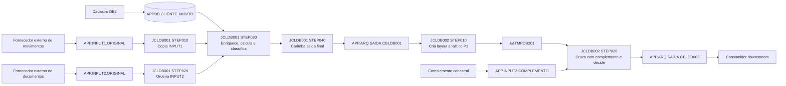

# SIPOC consolidado do processo mainframe

## Resumo executivo consolidado

O processo mainframe consolidado recebe movimentos operacionais de duas origens, enriquece os registros com dados cadastrais do DB2, calcula valores financeiros, padroniza a saida operacional e depois executa um pos-processamento analitico com complemento externo. A cadeia completa passa por `JCLDB001` e `JCLDB002`.

O `JCLDB001` prepara `APP.INPUT1.ORIGINAL` e `APP.INPUT2.ORIGINAL`, consulta a tabela `APPDB.CLIENTE_MOVTO`, calcula valores como `OUT-VALOR-CALC` e `OUT-TOTAL-GERAL`, classifica ocorrencias e publica `APP.ARQ.SAIDA.CBLDB001`. O `JCLDB002` consome essa saida, cria um layout analitico intermediario em `&&TMPDB201`, cruza os registros com `APP.INPUT3.COMPLEMENTO` e publica `APP.ARQ.SAIDA.CBLDB002` com decisao, prioridade, categoria final, canal destino, indicadores de limite e mensagens finais.

As regras de negocio documentadas em `business-rules.md` cobrem 18 regras confirmadas: 8 regras para `JCLDB001` e 10 regras para `JCLDB002`. Nao ha pendencias de negocio registradas nas fontes atuais.

Fontes principais usadas:

| Fonte | Papel |
|---|---|
| `lineage.md` | Origem, destino, step, programa, campo e transformacao tecnica |
| `business-rules.md` | Nomes funcionais, regras de negocio, dependencias e status |
| `mainframe/JCL`, `mainframe/programas`, `mainframe/copybooks`, `mainframe/dclgen` | Evidencia de apoio quando necessario |

## Diagrama Mermaid do fluxo SIPOC consolidado

## SIPOC compacto para negocio

| Fornecedor | Entrada | Processo | Saida | Cliente |
|---|---|---|---|---|
| Area operacional de movimentos | `APP.INPUT1.ORIGINAL` | Copiar movimentos para uso interno sem alterar o layout | `&&TMPIN001` | `JCLDB001 / STEP030` |
| Area operacional de documentos | `APP.INPUT2.ORIGINAL` | Ordenar documentos por chave e data de referencia | `&&TMPIN002` | `JCLDB001 / STEP030` |
| Cadastro corporativo DB2 | `APPDB.CLIENTE_MOVTO` | Enriquecer registros, calcular valores e classificar ocorrencias | `&&TMPOUT03` | `JCLDB001 / STEP040` |
| `JCLDB001` | `&&TMPOUT03` | Preservar saida operacional e carimbar o batch | `APP.ARQ.SAIDA.CBLDB001` | `JCLDB002 / STEP010` |
| `JCLDB001` | `APP.ARQ.SAIDA.CBLDB001` | Criar layout analitico com categoria, canal, faixa, alerta e score | `&&TMPDB201` | `JCLDB002 / STEP020` |
| Complemento cadastral | `APP.INPUT3.COMPLEMENTO` | Cruzar P1 com complemento, calcular ajustes e definir decisao final | `APP.ARQ.SAIDA.CBLDB002` | Consumidor downstream |

## SIPOC detalhado em nivel de campo

| Processo/Job | Fornecedor | Entrada/Campo origem | Processo/Regra | Campo criado ou atualizado | Saida | Cliente/Consumidor | Evidencia | Confianca |
|---|---|---|---|---|---|---|---|---|
| JCLDB001 | `APP.INPUT1.ORIGINAL` | `IN1-CHAVE`, `IN1-TIPO-REG`, `IN1-AGENCIA`, `IN1-CONTA`, `IN1-QTDE`, `IN1-FATOR`, `IN1-CANAL` | Copia fisica sem alteracao semantica | mesmos campos `IN1-*` | `&&TMPIN001` | `CBLDB001` | `STEP010 / ICEGENER / SYSIN DD DUMMY` | alto |
| JCLDB001 | `APP.INPUT2.ORIGINAL` | `IN2-CHAVE`, `IN2-DATA-REF`, registro `CPYIN002` | Ordenacao por chave e data | registro `IN2-*` ordenado | `&&TMPIN002` | `CBLDB001` | `SORT FIELDS=(1,10,CH,A,53,8,CH,A)` | alto |
| JCLDB001 | `INPUT1` e DB2 | `IN1-CHAVE`, `CHAVE_CLIENTE` | Lookup cadastral por chave | `OUT-NOME`, `OUT-STATUS`, `OUT-CODIGO-DB2`, `OUT-DATA-CAD`, `OUT-VALOR-BASE`, `OUT-PRECO-DB2` | `&&TMPOUT03` | `STEP040` | `CBLDB001 / 5000-BUSCA-DB2` | alto |
| JCLDB001 | `INPUT1` e DB2 | `HV-VALOR-BASE`, `IN1-FATOR` | Calculo do valor ajustado do ramo INPUT1 | `OUT-VALOR-CALC` | `&&TMPOUT03` | `STEP040` | `HV-VALOR-BASE * IN1-FATOR` | alto |
| JCLDB001 | `INPUT1` e DB2 | `IN1-QTDE`, `HV-PRECO-UNITARIO` | Calculo do total geral do ramo INPUT1 | `OUT-TOTAL-GERAL` | `&&TMPOUT03` | `STEP040` | `IN1-QTDE * HV-PRECO-UNITARIO` | alto |
| JCLDB001 | `INPUT1` | `IN1-TIPO-REG` | Classificacao de tipo e ocorrencia | `OUT-TIPO-SAIDA`, `OUT-OCORRENCIA` | `&&TMPOUT03` | `STEP040` | `A -> A1/000; demais -> A2/010` | alto |
| JCLDB001 | `INPUT2` e DB2 | `IN2-CHAVE`, `CHAVE_CLIENTE` | Lookup cadastral por chave | `OUT-NOME`, `OUT-STATUS`, `OUT-CODIGO-DB2`, `OUT-DATA-CAD`, `OUT-VALOR-BASE`, `OUT-PRECO-DB2`, `OUT-CANAL-SAIDA` | `&&TMPOUT03` | `STEP040` | `CBLDB001 / 5000-BUSCA-DB2` | alto |
| JCLDB001 | `INPUT2` e DB2 | `IN2-VALOR-UNIT`, `HV-FATOR-DB2` | Calculo do valor ajustado do ramo INPUT2 | `OUT-VALOR-CALC` | `&&TMPOUT03` | `STEP040` | `IN2-VALOR-UNIT * HV-FATOR-DB2` | alto |
| JCLDB001 | `INPUT2` e DB2 | `IN2-QUANTIDADE`, `HV-PRECO-UNITARIO` | Calculo do total geral do ramo INPUT2 | `OUT-TOTAL-GERAL` | `&&TMPOUT03` | `STEP040` | `IN2-QUANTIDADE * HV-PRECO-UNITARIO` | alto |
| JCLDB001 | `INPUT2` | `IN2-INDICADOR` | Classificacao de tipo e ocorrencia | `OUT-TIPO-SAIDA`, `OUT-OCORRENCIA` | `&&TMPOUT03` | `STEP040` | `S -> B1/000; demais -> B2/020` | alto |
| JCLDB001 | DB2 | `SQLCODE` | Tratamento de nao localizado ou erro DB2 | `OUT-TIPO-SAIDA`, `OUT-OCORRENCIA`, `OUT-STATUS`, `OUT-MSG`, valores zerados | `&&TMPOUT03` | `STEP040` | `7000-TRATA-DB2-NAO-OK` | alto |
| JCLDB001 | `&&TMPOUT03` | registro `REG-OUT` | Copia com overlay tecnico | `OUT-HARD-JCL` | `APP.ARQ.SAIDA.CBLDB001` | `JCLDB002` | `OUTREC OVERLAY=(291:C'JCLBATCH01')` | alto |
| JCLDB002 | `APP.ARQ.SAIDA.CBLDB001` | `OUT-CHAVE`, `OUT-ORIGEM`, `OUT-NOME`, `OUT-STATUS`, `OUT-TOTAL-GERAL`, `OUT-VALOR-CALC` | Criacao do layout P1 | `P1-CHAVE`, `P1-ORIGEM`, `P1-NOME`, `P1-STATUS`, `P1-TOTAL-GERAL`, `P1-VALOR-CALC` | `&&TMPDB201` | `CBLDB002B` | `CBLDB002A / 2100-TRATA-REGISTRO` | alto |
| JCLDB002 | `APP.ARQ.SAIDA.CBLDB001` | `OUT-STATUS`, `OUT-TOTAL-GERAL` | Classificacao analitica | `P1-CATEGORIA` | `&&TMPDB201` | `CBLDB002B` | `VIP/ATV/BLQ` | alto |
| JCLDB002 | `APP.ARQ.SAIDA.CBLDB001` | `OUT-CANAL-SAIDA`, `OUT-ORIGEM` | Agrupamento de canal | `P1-CANAL-GRUPO` | `&&TMPDB201` | `CBLDB002B` | `WE/AP/origem 2 -> DIGITAL; demais -> AGENCIA` | alto |
| JCLDB002 | `APP.ARQ.SAIDA.CBLDB001` | `OUT-TOTAL-GERAL` | Classificacao por faixa | `P1-FAIXA-TOTAL` | `&&TMPDB201` | `CBLDB002B` | `>7000000 -> A1; >2000000 -> B1; demais -> C1` | alto |
| JCLDB002 | `APP.ARQ.SAIDA.CBLDB001` | `OUT-OCORRENCIA`, `OUT-STATUS` | Sinalizacao de alerta | `P1-ALERTA` | `&&TMPDB201` | `CBLDB002B` | `000 e A -> N; demais -> S` | alto |
| JCLDB002 | `APP.ARQ.SAIDA.CBLDB001` | `OUT-VALOR-CALC`, `OUT-QTDE` | Calculo de score | `P1-SCORE` | `&&TMPDB201` | `CBLDB002B` | `(OUT-VALOR-CALC / 100) + OUT-QTDE` | alto |
| JCLDB002 | `&&TMPDB201` e `APP.INPUT3.COMPLEMENTO` | `P1-CHAVE`, `IN3-CHAVE` | Cruzamento por chave | campos finais `P2-*` com match ou default | `APP.ARQ.SAIDA.CBLDB002` | Downstream | `CBLDB002B / 2100-TRATA-REGISTRO` | alto |
| JCLDB002 | Complemento | `IN3-COD-SEGMENTO`, `IN3-FLAG-BLOQUEIO`, `IN3-LIMITE-CRED`, `IN3-DATA-REF` | Enriquecimento por match | `P2-SEGMENTO`, `P2-FLAG-BLOQUEIO`, `P2-LIMITE-CRED`, `P2-DATA-REF` | `APP.ARQ.SAIDA.CBLDB002` | Downstream | `2200-APLICA-MATCH` | alto |
| JCLDB002 | P1 e complemento | `P1-VALOR-CALC`, `IN3-FATOR-AJUSTE` | Calculo de ajuste | `P2-VALOR-AJUSTADO` | `APP.ARQ.SAIDA.CBLDB002` | Downstream | `P1-VALOR-CALC * IN3-FATOR-AJUSTE` | alto |
| JCLDB002 | P1 e complemento | `P1-TOTAL-GERAL`, `IN3-LIMITE-CRED` | Percentual e flag de limite | `P2-PERC-LIMITE`, `P2-FLAG-CROSS` | `APP.ARQ.SAIDA.CBLDB002` | Downstream | `(P1-TOTAL-GERAL / IN3-LIMITE-CRED) * 100`; total maior que limite -> `S` | alto |
| JCLDB002 | P1 e complemento | `IN3-TIPO-CLIENTE`, `P1-ALERTA`, `IN3-FLAG-BLOQUEIO`, `P1-CATEGORIA` | Decisao operacional final | `P2-PRIORIDADE`, `P2-DECISAO`, `P2-CATEGORIA-FINAL` | `APP.ARQ.SAIDA.CBLDB002` | Downstream | `APROVAR`, `BLOQUEAR`, `ANALISAR` ou `MANUAL` | alto |
| JCLDB002 | Sem complemento | `P1-CATEGORIA`, `P1-CANAL-GRUPO` | Defaults sem match | `P2-SEGMENTO`, `P2-LIMITE-CRED`, `P2-DECISAO`, `P2-MSG-FINAL` | `APP.ARQ.SAIDA.CBLDB002` | Downstream | `2300-APLICA-DEFAULT` | alto |

## Regras de negocio associadas

| Processo/Job | Regra | Categoria | Condicao | Resultado | Campos envolvidos | Rastreabilidade tecnica | Status |
|---|---|---|---|---|---|---|---|
| JCLDB001 | Regra 001 - Preservar INPUT1 | TRANSFORMACAO | Todo registro de `APP.INPUT1.ORIGINAL` | Copia para `&&TMPIN001` | `IN1-*` | `STEP010 / ICEGENER` | Confirmado |
| JCLDB001 | Regra 002 - Ordenar INPUT2 | ORDENACAO | Ordenacao por chave e data | `&&TMPIN002` ordenado | `IN2-CHAVE`, `IN2-DATA-REF` | `STEP020 / SORT` | Confirmado |
| JCLDB001 | Regra 003 - Enriquecer com DB2 | ENRIQUECIMENTO | Lookup por chave | Dados cadastrais na saida | `IN1-CHAVE`, `IN2-CHAVE`, `HV-*`, `OUT-*` | `CBLDB001 / 5000-BUSCA-DB2` | Confirmado |
| JCLDB001 | Regra 004 - Processar INPUT1 | CALCULO | `SQLCODE = 0` | Valor calculado e total geral INPUT1 | `IN1-QTDE`, `IN1-FATOR`, `HV-VALOR-BASE`, `HV-PRECO-UNITARIO` | `2100-TRATA-IN1` | Confirmado |
| JCLDB001 | Regra 005 - Classificar INPUT1 | CLASSIFICACAO | `IN1-TIPO-REG` e status DB2 | Tipo, ocorrencia e mensagem | `IN1-TIPO-REG`, `HV-STATUS-CLIENTE`, `OUT-*` | `2100-TRATA-IN1` | Confirmado |
| JCLDB001 | Regra 006 - Processar INPUT2 | CALCULO | `SQLCODE = 0` | Valor calculado e total geral INPUT2 | `IN2-VALOR-UNIT`, `IN2-QUANTIDADE`, `HV-FATOR-DB2`, `HV-PRECO-UNITARIO` | `3100-TRATA-IN2` | Confirmado |
| JCLDB001 | Regra 007 - Classificar INPUT2 e DB2 | CLASSIFICACAO | Indicador ou erro DB2 | Tipo, ocorrencia, status e mensagem | `IN2-INDICADOR`, `SQLCODE`, `OUT-*` | `3100-TRATA-IN2`; `7000-TRATA-DB2-NAO-OK` | Confirmado |
| JCLDB001 | Regra 008 - Carimbar saida | ENRIQUECIMENTO | STEP040 final | `OUT-HARD-JCL = JCLBATCH01` | `OUT-HARD-JCL` | `OUTREC OVERLAY` | Confirmado |
| JCLDB002 | Regra 009 - Criar P1 | TRANSFORMACAO | Todo registro de `APP.ARQ.SAIDA.CBLDB001` | `&&TMPDB201` | `OUT-*`, `P1-*` | `CBLDB002A / 2100-TRATA-REGISTRO` | Confirmado |
| JCLDB002 | Regra 010 - Categoria analitica | CLASSIFICACAO | Status e total | `VIP`, `ATV` ou `BLQ` | `OUT-STATUS`, `OUT-TOTAL-GERAL`, `P1-CATEGORIA` | `CBLDB002A` | Confirmado |
| JCLDB002 | Regra 011 - Canal, faixa e alerta | CLASSIFICACAO | Canal, origem, total, ocorrencia e status | `P1-CANAL-GRUPO`, `P1-FAIXA-TOTAL`, `P1-ALERTA` | `OUT-*`, `P1-*` | `CBLDB002A` | Confirmado |
| JCLDB002 | Regra 012 - Score e mensagem | CALCULO | Sempre, por registro P1 | `P1-SCORE`, `P1-MSG-ANALISE` | `OUT-VALOR-CALC`, `OUT-QTDE`, `P1-*` | `CBLDB002A` | Confirmado |
| JCLDB002 | Regra 013 - Cruzar complemento | ENRIQUECIMENTO | `IN3-CHAVE = P1-CHAVE` | Dados complementares no P2 | `P1-CHAVE`, `IN3-*`, `P2-*` | `CBLDB002B / 2200-APLICA-MATCH` | Confirmado |
| JCLDB002 | Regra 014 - Ajuste e limite | CALCULO | Match com complemento | Valor ajustado, percentual e cross | `P1-VALOR-CALC`, `IN3-FATOR-AJUSTE`, `P1-TOTAL-GERAL`, `IN3-LIMITE-CRED` | `CBLDB002B / 2200-APLICA-MATCH` | Confirmado |
| JCLDB002 | Regra 015 - Canal destino | CLASSIFICACAO | Canal digital ou nao digital | `WB`, canal referencia ou `AG` | `P1-CANAL-GRUPO`, `IN3-CANAL-REF` | `2200-APLICA-MATCH`; `2300-APLICA-DEFAULT` | Confirmado |
| JCLDB002 | Regra 016 - Decisao final | CLASSIFICACAO | Premium sem alerta, bloqueio ou demais casos | `APROVAR`, `BLOQUEAR`, `ANALISAR` | `IN3-TIPO-CLIENTE`, `P1-ALERTA`, `IN3-FLAG-BLOQUEIO`, `P1-CATEGORIA` | `CBLDB002B / 2200-APLICA-MATCH` | Confirmado |
| JCLDB002 | Regra 017 - Defaults sem complemento | ENRIQUECIMENTO | Sem match no INPUT3 | Decisao `MANUAL` e defaults | `P1-*`, `P2-*` | `CBLDB002B / 2300-APLICA-DEFAULT` | Confirmado |
| JCLDB002 | Regra 018 - Propagar identificadores | TRANSFORMACAO | Todo registro P1 | Identificadores e atributos no P2 | `P1-CHAVE`, `P1-ORIGEM`, `P1-NOME`, `P1-STATUS`, `P1-SCORE` | `CBLDB002B / 2100-TRATA-REGISTRO` | Confirmado |

## Consolidado unico de campos utilizados

| Campo | Tipo de uso | Origem | Destino | Regra associada | Processo/Job | Step/Programa | Consumidor | Observacao |
|---|---|---|---|---|---|---|---|---|
| `IN1-CHAVE` | chave | `APP.INPUT1.ORIGINAL` | `OUT-CHAVE`, lookup DB2 | 001, 003, 004 | JCLDB001 | STEP010, CBLDB001 | `APP.ARQ.SAIDA.CBLDB001` | Chave do ramo INPUT1 |
| `IN1-TIPO-REG` | entrada | `APP.INPUT1.ORIGINAL` | `OUT-TIPO-SAIDA`, `OUT-OCORRENCIA` | 001, 005 | JCLDB001 | STEP010, CBLDB001 | `APP.ARQ.SAIDA.CBLDB001` | Classificacao A1/A2 |
| `IN1-AGENCIA` | entrada | `APP.INPUT1.ORIGINAL` | `OUT-AGENCIA` | 001, 004 | JCLDB001 | CBLDB001 | `APP.ARQ.SAIDA.CBLDB001` | Copia direta |
| `IN1-CONTA` | entrada | `APP.INPUT1.ORIGINAL` | `OUT-CONTA` | 001, 004 | JCLDB001 | CBLDB001 | `APP.ARQ.SAIDA.CBLDB001` | Copia direta |
| `IN1-QTDE` | calculo | `APP.INPUT1.ORIGINAL` | `OUT-QTDE`, `OUT-TOTAL-GERAL` | 004 | JCLDB001 | CBLDB001 | JCLDB002 | Quantidade do ramo INPUT1 |
| `IN1-FATOR` | calculo | `APP.INPUT1.ORIGINAL` | `OUT-FATOR`, `OUT-VALOR-CALC` | 004 | JCLDB001 | CBLDB001 | JCLDB002 | Fator do movimento |
| `IN1-CANAL` | entrada | `APP.INPUT1.ORIGINAL` | `OUT-CANAL-SAIDA` | 004 | JCLDB001 | CBLDB001 | JCLDB002 | Canal preservado no ramo INPUT1 |
| `IN2-CHAVE` | chave | `APP.INPUT2.ORIGINAL` | `OUT-CHAVE`, lookup DB2 | 002, 003, 006 | JCLDB001 | STEP020, CBLDB001 | JCLDB002 | Chave do ramo INPUT2 |
| `IN2-DATA-REF` | entrada | `APP.INPUT2.ORIGINAL` | ordenacao | 002 | JCLDB001 | STEP020 SORT | CBLDB001 | Chave secundaria de ordenacao |
| `IN2-DOCUMENTO` | entrada | `APP.INPUT2.ORIGINAL` | `OUT-DOCUMENTO` | 006 | JCLDB001 | CBLDB001 | JCLDB002 | Copia direta |
| `IN2-VALOR-UNIT` | calculo | `APP.INPUT2.ORIGINAL` | `OUT-VALOR-CALC` | 006 | JCLDB001 | CBLDB001 | JCLDB002 | Valor unitario do ramo INPUT2 |
| `IN2-QUANTIDADE` | calculo | `APP.INPUT2.ORIGINAL` | `OUT-QTDE`, `OUT-TOTAL-GERAL` | 006 | JCLDB001 | CBLDB001 | JCLDB002 | Quantidade do ramo INPUT2 |
| `IN2-INDICADOR` | entrada | `APP.INPUT2.ORIGINAL` | `OUT-TIPO-SAIDA`, `OUT-OCORRENCIA` | 007 | JCLDB001 | CBLDB001 | JCLDB002 | Classificacao B1/B2 |
| `CHAVE_CLIENTE` | lookup | `APPDB.CLIENTE_MOVTO` | consulta DB2 | 003 | JCLDB001 | CBLDB001 | CBLDB001 | Chave de pesquisa |
| `NOME_CLIENTE` | lookup | `APPDB.CLIENTE_MOVTO` | `OUT-NOME`, `P1-NOME`, `P2-NOME` | 003, 009, 018 | JCLDB001/JCLDB002 | CBLDB001, CBLDB002A/B | Downstream | Nome cadastral |
| `STATUS_CLIENTE` | lookup | `APPDB.CLIENTE_MOVTO` | `OUT-STATUS`, `P1-STATUS`, `P2-STATUS` | 003, 005, 010, 018 | JCLDB001/JCLDB002 | CBLDB001, CBLDB002A/B | Downstream | Status cadastral |
| `CODIGO_DB2` | lookup | `APPDB.CLIENTE_MOVTO` | `OUT-CODIGO-DB2`, `P1-CODIGO-DB2`, `P2-CODIGO-DB2` | 003, 009, 018 | JCLDB001/JCLDB002 | CBLDB001, CBLDB002A/B | Downstream | Codigo interno |
| `VALOR_BASE` | calculo | `APPDB.CLIENTE_MOVTO` | `OUT-VALOR-BASE`, `OUT-VALOR-CALC` | 003, 004 | JCLDB001 | CBLDB001 | JCLDB002 | Base financeira INPUT1 |
| `PRECO_UNITARIO` | calculo | `APPDB.CLIENTE_MOVTO` | `OUT-PRECO-DB2`, `OUT-TOTAL-GERAL` | 003, 004, 006 | JCLDB001 | CBLDB001 | JCLDB002 | Preco corporativo |
| `FATOR_DB2` | calculo | `APPDB.CLIENTE_MOVTO` | `OUT-VALOR-CALC` | 003, 006 | JCLDB001 | CBLDB001 | JCLDB002 | Fator cadastral INPUT2 |
| `CANAL_PREFERENC` | lookup | `APPDB.CLIENTE_MOVTO` | `OUT-CANAL-SAIDA` | 003, 006 | JCLDB001 | CBLDB001 | JCLDB002 | Sobrescreve canal do INPUT2 |
| `OUT-VALOR-CALC` | calculo | JCLDB001 | `P1-VALOR-CALC`, `P1-SCORE`, `P2-VALOR-AJUSTADO` | 004, 006, 012, 014 | JCLDB001/JCLDB002 | CBLDB001, CBLDB002A/B | Downstream | Valor base para score e ajuste |
| `OUT-TOTAL-GERAL` | calculo | JCLDB001 | `P1-TOTAL-GERAL`, `P1-CATEGORIA`, `P1-FAIXA-TOTAL`, `P2-PERC-LIMITE`, `P2-FLAG-CROSS` | 004, 006, 010, 011, 014 | JCLDB001/JCLDB002 | CBLDB001, CBLDB002A/B | Downstream | Total financeiro principal |
| `OUT-HARD-JCL` | controle tecnico | STEP040 SORT | `APP.ARQ.SAIDA.CBLDB001` | 008 | JCLDB001 | STEP040 SORT | JCLDB002 | Carimbo `JCLBATCH01` |
| `P1-CATEGORIA` | intermediario | CBLDB002A | `P2-CATEGORIA-FINAL` | 010, 016, 017 | JCLDB002 | STEP010/STEP020 | Downstream | Categoria VIP/ATV/BLQ |
| `P1-CANAL-GRUPO` | intermediario | CBLDB002A | `P2-CANAL-DESTINO` | 011, 015 | JCLDB002 | STEP010/STEP020 | Downstream | DIGITAL ou AGENCIA |
| `P1-ALERTA` | intermediario | CBLDB002A | `P2-PRIORIDADE`, `P2-DECISAO`, `P2-CATEGORIA-FINAL` | 011, 016 | JCLDB002 | STEP010/STEP020 | Downstream | Sinaliza revisao |
| `P1-SCORE` | calculo | CBLDB002A | `P2-SCORE` | 012, 018 | JCLDB002 | STEP010/STEP020 | Downstream | Score analitico |
| `IN3-CHAVE` | chave | `APP.INPUT3.COMPLEMENTO` | match com `P1-CHAVE` | 013 | JCLDB002 | CBLDB002B | Downstream | Chave de complemento |
| `IN3-COD-SEGMENTO` | entrada | `APP.INPUT3.COMPLEMENTO` | `P2-SEGMENTO` | 013 | JCLDB002 | CBLDB002B | Downstream | Segmento complementar |
| `IN3-FATOR-AJUSTE` | calculo | `APP.INPUT3.COMPLEMENTO` | `P2-VALOR-AJUSTADO` | 014 | JCLDB002 | CBLDB002B | Downstream | Fator externo de ajuste |
| `IN3-LIMITE-CRED` | calculo | `APP.INPUT3.COMPLEMENTO` | `P2-LIMITE-CRED`, `P2-PERC-LIMITE`, `P2-FLAG-CROSS` | 013, 014 | JCLDB002 | CBLDB002B | Downstream | Limite de credito |
| `IN3-CANAL-REF` | entrada | `APP.INPUT3.COMPLEMENTO` | `P2-CANAL-DESTINO` | 015 | JCLDB002 | CBLDB002B | Downstream | Canal de referencia |
| `IN3-TIPO-CLIENTE` | entrada | `APP.INPUT3.COMPLEMENTO` | `P2-PRIORIDADE`, `P2-DECISAO`, `P2-CATEGORIA-FINAL` | 016 | JCLDB002 | CBLDB002B | Downstream | Premium ou comum |
| `IN3-FLAG-BLOQUEIO` | entrada | `APP.INPUT3.COMPLEMENTO` | `P2-FLAG-BLOQUEIO`, `P2-DECISAO`, `P2-CATEGORIA-FINAL` | 013, 016 | JCLDB002 | CBLDB002B | Downstream | Bloqueio complementar |
| `P2-DECISAO` | saida | CBLDB002B | `APP.ARQ.SAIDA.CBLDB002` | 016, 017 | JCLDB002 | STEP020 | Downstream | APROVAR, BLOQUEAR, ANALISAR ou MANUAL |
| `P2-CATEGORIA-FINAL` | saida | CBLDB002B | `APP.ARQ.SAIDA.CBLDB002` | 016, 017 | JCLDB002 | STEP020 | Downstream | PRM, BLK ou categoria P1 |
| `P2-VALOR-AJUSTADO` | saida | CBLDB002B | `APP.ARQ.SAIDA.CBLDB002` | 014, 017 | JCLDB002 | STEP020 | Downstream | Zero sem match |

## Lacunas, inferencias e notas de confianca

**Evidencia observada**

- `lineage.md` documenta `JCLDB001` e `JCLDB002`, seus steps, datasets, tabelas, campos de saida, origens, transformacoes e consumidores.
- `business-rules.md` documenta 18 regras confirmadas, dependencias entre jobs e ausencia de pendencias de negocio registradas.
- Os artefatos mainframe confirmam os programas `CBLDB001`, `CBLDB002A`, `CBLDB002B`, copybooks e DCLGEN usados pelas regras.

**Interpretacao inferida**

- O consumidor final de `APP.ARQ.SAIDA.CBLDB002` foi tratado como `Downstream`, porque a fonte informa consumidor downstream sem nomear um sistema especifico.
- Os fornecedores de `APP.INPUT1.ORIGINAL`, `APP.INPUT2.ORIGINAL` e `APP.INPUT3.COMPLEMENTO` foram descritos funcionalmente como fontes externas/operacionais, porque os DSNs e layouts indicam entradas externas, mas nao nomeiam areas proprietarias.

**nivel de confianca**

| Item | Nivel | Justificativa |
|---|---|---|
| Fluxo entre `JCLDB001` e `JCLDB002` | alto | Registrado em `lineage.md` e no JCL `JCLDB002` |
| Regras de calculo e classificacao | alto | Documentadas em `business-rules.md` e rastreaveis aos paragrafos COBOL |
| Nomes funcionais dos fornecedores externos | medio | Inferidos pelos nomes dos datasets e layouts |
| Consumidor final downstream | medio | Fonte indica downstream, mas nao identifica sistema consumidor |

